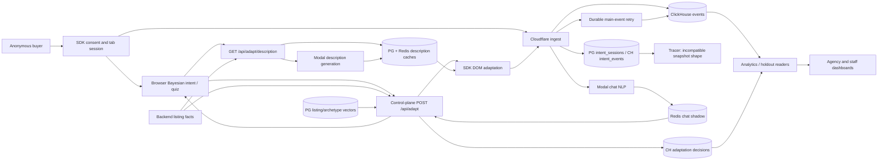
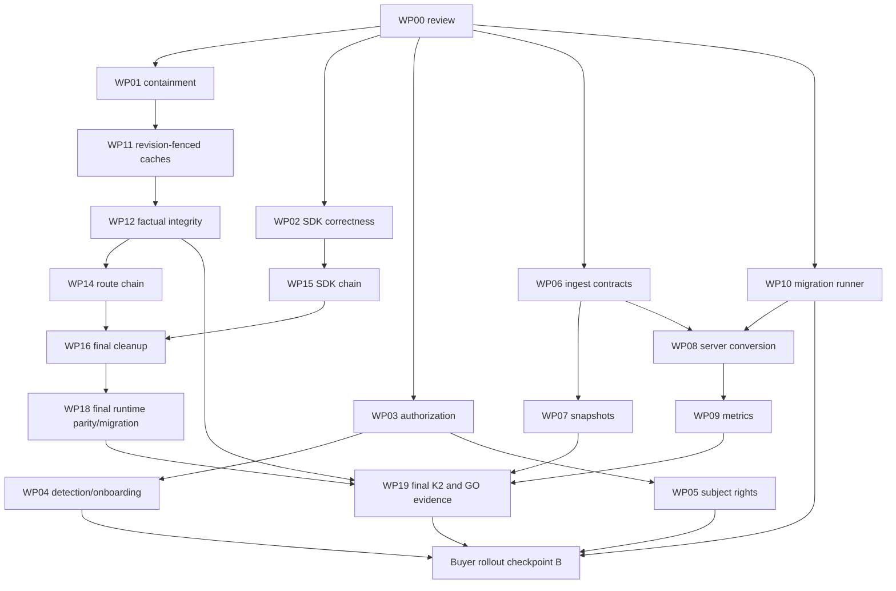

# Adaptive Listings — phased code audit

Audit date: 2026-10-06. Repository: Pnawrocki9/Adaptive-Listings, main, commit 334082c1bd26aec1a473d97d4617d943ba54a18c. All source references are relative to /workspace/Adaptive-Listings and commit-scoped. Application source and backlog were not changed. Findings distinguish source wiring, local execution and unmeasured deployment state.

## 1. Executive Summary

**Verdict: 🔴 RED for buyer-facing pilot readiness. Continue on this foundation, with the fixes below.** The product has a real browser classifier, real chat extraction, connected adaptation services, permanent description caches and working dashboard APIs. The original description of an unfinished placeholder intent engine is obsolete. The current foundation nevertheless permits fabricated property facts, can miss the adaptation after a second chat message, can repaint personalization after opt-out, and does not yet measure the adopted server-confirmed conversion. Finishing the remaining queue without correcting these behaviors would not meet the product's requirements. These are repairable implementation and contract defects; the evidence does not justify replacing the decided stack.

**Progress: 2 of 26 engineering rows assessed for current closure in §Snapshot.1 meet strict Done criteria, approximately 8%.** This is an equal-weight deliverable-closure estimate, not a percentage of code written or effort remaining. Eleven parked rows and six strategy/policy/history rows are excluded. Most other engineering rows have substantial implementation; two supposedly shipped rows are broken. The Phase 1 estimate was provisional and falls after applying confirmed findings to closure status.

The five main reasons for RED are:

- **Two Critical factual-integrity defects:** description generation detects invented numbers but still publishes them; directive validation permits invented features and reassignment of price as area (F-01, F-02).
- **Buyer adaptation is not proved by the chat badge:** FOLLOW-1301 sends a follow-up only when the archetype changes, losing a confidence increase above the server gate. AC(8) still grades label movement rather than the stronger adopted result (F-04; FOLLOW-1302).
- **Privacy and authorization remain incomplete:** opt-out races, expired JWT acceptance, read-only writes, unscoped ClickHouse erasure and a dead DSR ownership prerequisite (F-09–F-14).
- **Measurement is not the adopted experiment:** browser CTA clicks, pre-exposure attribution, inconsistent holdout filtering and multiplied inquiry counts remain (F-08, F-21, F-22).
- **Green isolated tests miss cross-layer contracts:** the actual snapshot producer cannot feed its tracer readers; accepted batches can disappear; cache invalidation can resurrect withdrawn facts (F-03, F-06, F-07). Existing suites are extensive and pass on a current Node 22 runtime, but do not establish these invariants.

No fresh production migration/grant, live-model quality, production traffic, load-latency or FOLLOW-820 GO attestation was possible. Local reproductions establish reachable behavior, not production incidence or business uplift.

## 2. Plan Baseline (what was supposed to exist)

- The operative baseline is docs/MASTER_DESIGN.md **v4.18, dated 2026-10-04**, especially §Snapshot.0/§Snapshot.1, accepted ADRs and the later dated amendments. Older architectural snapshots are explicitly historical at `docs/MASTER_DESIGN.md:647` and `docs/MASTER_DESIGN.md:7714`.
- The actual repository has **five apps and five packages**, per `CLAUDE.md:58`. decision-api, stream-consumer and several placeholder services/packages were removed. The canonical adaptation endpoint is control-plane **POST /api/adapt**; GET is retired, per `docs/adr/ADR-0004-canonical-adapt-endpoint.md:12` and `apps/control-plane/src/app/api/adapt/route.ts:1099`.
- The fast intent path is SDK Bayesian inference. Real Python chat NLP extracts twelve dimensions, writes a session shadow record and feeds the next SDK posterior through /api/adapt. The SDK canonical eighteen IDs, shared mirror and Python IDs agree. This is not a 27-line placeholder or a three-ID classifier (`packages/sdk/src/core/intent.ts:49`; `packages/shared/src/archetypes.ts:36`; `apps/intent-engine/src/nlp.py:71`).
- Listing-grounded adaptation changes copy/emphasis/order. Every property assertion must derive from that listing; an archetype/template is not a source of property facts. Missing grounding means preserve original copy (`docs/MASTER_DESIGN.md:3385`). The seven-level placeholder target is not fully implemented; the current five-fact resolver safely drops unresolved directives.
- Reordering has a real tenant-scoped, 1024-dimensional embedding path. Missing vectors withhold the entire reorder; old djb2 labels are diagnostics, not a served hash ranking (`apps/control-plane/src/app/api/adapt/route.ts:970`). Seeded archetype vectors are not evidence of a learned, privacy-preserving data network effect.
- Description generation is asynchronous direct HTTP to a real Modal job. Current providers call Anthropic directly in TS/Python. The event bus is retired. A single TS LLM runtime is proposed **last** under FOLLOW-1297, acceptance of reserved ADR-0023 and parity checks; it is not the current implementation requirement. Cache v2 uses durable PostgreSQL plus Redis without description TTL, invalidated on listing.updated.
- **No product tiers.** page_context denotes page kind. Quiz v2 behavior is preserved by ADR-0019's current definition-driven renderer, including seventeen non-neutral leaves and neutral skip; quiz defaults off. Templates/adapters, multi-region and data-quality production deployment are parked intentionally.
- Holdout and decision logs remain; **bandit learning is intentionally frozen** with BANDIT_ENABLED off. Do not unfreeze it as a prerequisite for this pilot (`apps/control-plane/src/app/api/adapt/route.ts:1485`).
- Current work is the approved FOLLOW-1257 remediation program: Phase 0/1 complete, K1 accepted, Phase 2 in progress. FOLLOW-820 remains the exit gate from localhost. The real control plane is required; the :9100 mock is not product evidence (`CLAUDE.md:24`). Newer chat rulings require two messages and an actual adapted response (`backlog/FOLLOW_UPS.md:54659`).
- PostgreSQL migrations have a push-to-main automation path; ClickHouse changes still require operator application. A merge is not fresh evidence of application. The local first-pilot scope is EU/single-tenant; expansion, positive business uplift and several operational projects are outside the immediate GO gate.

Build order is detailed in §7.3. README's current Sprint 22b pointer and the August STATUS log are historical orientation, not current closure evidence. The initial claims of Sprint 0, eight of thirty-seven events, a 93.3 KB SDK, live Redpanda, an active decision-api and a placeholder intent engine are not current facts.

## 3. System Map

| Stage                           | Real implementation / consumer                                                                                                                                                                     | State at this commit                                                                              |
| ------------------------------- | -------------------------------------------------------------------------------------------------------------------------------------------------------------------------------------------------- | ------------------------------------------------------------------------------------------------- |
| SDK load, consent and session   | `packages/sdk/src/index.ts:367`; `packages/sdk/src/core/session.ts:126`; `packages/sdk/src/core/consent-text.ts:55`                                                                                | Connected. Random tab UUID; consent disclosure must load before initialization.                   |
| Browser capture and classifier  | `packages/sdk/src/core/observer.ts:606`; `packages/sdk/src/index.ts:1384`; `packages/sdk/src/core/intent.ts:882`                                                                                   | Connected. Curated Bayesian weights, not learned accuracy evidence.                               |
| Event transport                 | `packages/sdk/src/core/events.ts:97`; `apps/ingest/src/router.ts:128`; `apps/ingest/src/handlers/events.ts:369`                                                                                    | Connected. Frozen retry batches, authenticated tenant identity, per-event consent classification. |
| Durable main analytics stream   | `apps/ingest/src/clickhouse-producer.ts:210`; `apps/ingest/src/events-retry-queue.ts:96`; `apps/ingest/src/handlers/events-retry-consumer.ts:46`                                                   | Connected when configured. Reliability boundary defects F-06/F-15. No bus/stream-consumer.        |
| Session snapshots / tracer      | `apps/ingest/src/handlers/intent-snapshot.ts:283`; `apps/control-plane/src/app/api/admin/tracer/sessions/route.ts:110`                                                                             | Connected transport, broken producer/reader shape (F-07); independent writes lack replay.         |
| Real-time chat NLP              | `apps/ingest/src/handlers/chat-nlp-dispatch.ts:100`; `apps/intent-engine/src/main.py:73`; `apps/intent-engine/src/nlp.py:431`; `apps/intent-engine/src/redis_writer.py:121`                        | Connected, configuration dependent. Direct spawn, 24-hour shadow state, no batch scheduler.       |
| Chat back into browser intent   | `apps/control-plane/src/lib/chat-intent-cache.ts:224`; `apps/control-plane/src/app/api/adapt/route.ts:1642`; `packages/sdk/src/core/adapt.ts:1128`                                                 | Connected. State/lifecycle/follow-up defects F-04/F-05/F-25.                                      |
| Canonical adaptation            | `apps/control-plane/src/app/api/adapt/route.ts:1099`; `apps/control-plane/src/lib/listing-facts-context.ts:91`; `apps/control-plane/src/lib/llm-gateway.ts:1390`                                   | Real POST handler/provider calls. No current decision-api counterpart. F-02 factual enforcement.  |
| Listing embedding / reorder     | `apps/control-plane/src/app/api/listings/embed/route.ts:186`; `apps/control-plane/src/lib/embedding-lookup.ts:81`; `apps/control-plane/src/app/api/adapt/route.ts:1002`                            | Connected cosine ranking, or explicit withholding. Not a learned classifier/network effect.       |
| Description cache/generation    | `apps/control-plane/src/app/api/adapt/description/route.ts:301`; `apps/llm-gateway/src/jobs/generate_description.py:491`; `apps/control-plane/src/app/api/internal/description-cache/route.ts:172` | Connected PG → Redis → backend grounding → Modal → cache callback. F-01/F-03/F-17.                |
| DOM commit / telemetry          | `packages/sdk/src/index.ts:1043`; `packages/sdk/src/core/adapt.ts:557`; `packages/sdk/src/core/adapt-description.ts:412`                                                                           | Connected; stale navigation guards exist. Opt-out/teardown/persistence guards incomplete.         |
| Holdout / analytics / dashboard | `apps/control-plane/src/app/api/adapt/route.ts:1333`; `apps/control-plane/src/app/api/admin/analytics/rollup/data.ts:196`; `apps/control-plane/src/app/dashboard/analytics/page.tsx:792`           | Connected. Frozen bandit, live/mocked provenance displayed; conversion/cohort defects remain.     |
| DSR                             | `apps/control-plane/src/app/api/dsr/initiate/route.ts:139`; `apps/control-plane/src/app/api/dsr/erase/route.ts:317`; `apps/control-plane/src/lib/clickhouse-dsr.ts:173`                            | New-session ownership hop dead; downstream routes real. F-13/F-14/F-35.                           |
| Intentionally parked surfaces   | `packages/platform-templates/src/index.ts:47`; `packages/platform-templates/src/templates/index.ts:30`; `apps/data-quality/src/crons/schema_validation.py:515`                                     | Templates empty/null; validator real but production deployment parked.                            |



The graph describes source wiring. External URLs, secrets, deployed functions, KV projections, tables and grants must exist for the corresponding edges to execute. Success-shaped no-configuration branches are not storage or model evidence.

## 4. Critical Path Walkthrough

This traces one consented anonymous buyer, then a chat message, listing adaptation and measurement. Connected describes reachable code, not a newly observed full production session.

| Hop                                        | Status    | Evidence and actual behavior                                                                                                                                                                                                                                                                                                                                                                                                                                                       |
| ------------------------------------------ | --------- | ---------------------------------------------------------------------------------------------------------------------------------------------------------------------------------------------------------------------------------------------------------------------------------------------------------------------------------------------------------------------------------------------------------------------------------------------------------------------------------- |
| 1. Load SDK and disclosure                 | connected | `packages/sdk/src/index.ts:434` waits for identifier-free consent text; `packages/sdk/src/index.ts:436` halts on failure. Denial clears state; grant initializes collection.                                                                                                                                                                                                                                                                                                       |
| 2. Create session                          | connected | `packages/sdk/src/core/session.ts:126` creates tab UUID; `packages/sdk/src/core/session.ts:143` persists it in sessionStorage. The local xid is not a transmitted global fingerprint.                                                                                                                                                                                                                                                                                              |
| 3. Capture behavior and classify           | connected | `packages/sdk/src/core/observer.ts:606` → `packages/sdk/src/index.ts:1384` → `packages/sdk/src/core/intent.ts:882`. Same captured signal queues telemetry and updates local posterior. F-05 affects later interleavings.                                                                                                                                                                                                                                                           |
| 4. Batch POST and authenticate             | connected | `packages/sdk/src/core/events.ts:118` samples consent; `packages/sdk/src/core/events.ts:133` sends key/session/idempotency headers. `apps/ingest/src/handlers/events.ts:140` authenticates, `apps/ingest/src/handlers/events.ts:212` validates origin, `apps/ingest/src/handlers/events.ts:369` parses schema. Cached replies bypass these gates (F-18).                                                                                                                           |
| 5. Store main events                       | connected | `apps/ingest/src/handlers/events.ts:649` schedules JSONEachRow and `apps/ingest/src/handlers/events.ts:801` ACKs. Failed results enqueue at `apps/ingest/src/handlers/events.ts:713`. Local CH insertion passes; invalid timestamp and oversize recovery break durability (F-06/F-15). Unset CH writes nothing.                                                                                                                                                                    |
| 6. Persist intent snapshot                 | connected | `apps/ingest/src/handlers/events.ts:500` invokes dual-write handler; `apps/ingest/src/handlers/intent-snapshot.ts:305` writes the wrong JSONB shape. Transport connects but live tracer values are lost (F-07).                                                                                                                                                                                                                                                                    |
| 7. Capture optional buyer chat             | connected | `packages/sdk/src/index.ts:1729` handles the host chat event; `packages/sdk/src/index.ts:1758` keeps chat ingest while forwarding profiling_opted_out. No external site traffic was verified.                                                                                                                                                                                                                                                                                      |
| 8. Dispatch and extract chat dimensions    | connected | `apps/ingest/src/handlers/events.ts:553` → `apps/ingest/src/handlers/chat-nlp-dispatch.ts:100` → `apps/intent-engine/src/main.py:93` → `apps/intent-engine/src/nlp.py:431`. Real provider call/spawn, configuration dependent. Transient direct-hop loss is explicitly accepted by ADR-0016.                                                                                                                                                                                       |
| 9. Write/read session shadow               | connected | `apps/intent-engine/src/redis_writer.py:121` suppresses opted-out profile writes and otherwise SETs with 24-hour expiry. Adapt reads at `apps/control-plane/src/app/api/adapt/route.ts:1642` and returns dimensions/stamp at `apps/control-plane/src/app/api/adapt/route.ts:1700`. TS/Python Redis aliases must address the same service.                                                                                                                                          |
| 10. Fold and request adaptation again      | connected | `packages/sdk/src/core/adapt.ts:1146` folds the prior. `packages/sdk/src/index.ts:963` sends one follow-up for a changed archetype. A changed confidence with unchanged archetype is missed (F-04); bookkeeping loss permits duplicate folds (F-05).                                                                                                                                                                                                                               |
| 11. Authenticate canonical POST /api/adapt | connected | `apps/control-plane/src/app/api/adapt/route.ts:1139` resolves tenant; `apps/control-plane/src/app/api/adapt/route.ts:1200` rejects opt-out; `apps/control-plane/src/app/api/adapt/route.ts:1255` checks tenant enablement; `apps/control-plane/src/app/api/adapt/route.ts:1333` assigns secret-backed holdout. Holdout returns zero directives and logs. GET is retired.                                                                                                           |
| 12. Get listing grounding and decide       | connected | `apps/control-plane/src/lib/listing-details.ts:71` fetches backend listing; `apps/control-plane/src/lib/listing-facts-context.ts:91` merges facts. runDecisionTree consumes the sent confidence at `apps/control-plane/src/app/api/adapt/route.ts:1517`; ≤0.6 withholds. Real gateway output can still invent facts (F-02).                                                                                                                                                        |
| 13. Optional FAQ retrieval                 | dead      | Standard SDK body contains no intent_vector at `packages/sdk/src/core/adapt.ts:1014`; description explicitly passes null at `apps/control-plane/src/app/api/adapt/description/route.ts:431`. `apps/control-plane/src/lib/rag-retrieval.ts:44` returns empty before SQL. Optional API helper exists, normal SDK consumer does not reach it (F-28).                                                                                                                                  |
| 14. Optional listing reorder               | connected | `apps/control-plane/src/app/api/adapt/route.ts:1582` loads vectors; `apps/control-plane/src/app/api/adapt/route.ts:993` withholds if any are missing; `apps/control-plane/src/app/api/adapt/route.ts:1002` sorts cosine scores. This is listing ordering, not learned buyer classification.                                                                                                                                                                                        |
| 15. Request long description               | connected | `packages/sdk/src/index.ts:1091` gates separately; `packages/sdk/src/core/adapt-description.ts:330` GETs listing/archetype/locale. PG first at `apps/control-plane/src/app/api/adapt/description/route.ts:301`, Redis next at `apps/control-plane/src/app/api/adapt/description/route.ts:372`. Cached FIT returns ai_cached; NEUTRAL preserves original.                                                                                                                           |
| 16. Generate on cache miss                 | connected | `apps/control-plane/src/app/api/adapt/description/route.ts:475` registers direct Modal dispatch through afterResponse; `apps/llm-gateway/src/jobs/generate_description.py:2259` authenticates/spawns; `apps/llm-gateway/src/jobs/generate_description.py:531` invokes generation; `apps/llm-gateway/src/jobs/generate_description.py:619`; `apps/llm-gateway/src/jobs/generate_description.py:625` write Redis/PG. F-01 permits invalid facts; F-03 permits stale facts to return. |
| 17. Receive completed description          | connected | `packages/sdk/src/core/adapt-description.ts:412` performs one read and `packages/sdk/src/core/adapt-description.ts:424` ignores fallback. Completion is seen only on another qualifying SDK refresh; there is no dedicated completion poll. This is an asynchronous availability limit, not a verified first-visit delivery SLA.                                                                                                                                                   |
| 18. Apply DOM and emit result              | connected | `packages/sdk/src/index.ts:1043` separates directive/description floors. `packages/sdk/src/core/adapt-description.ts:419` guards navigation staleness; `packages/sdk/src/core/adapt-description.ts:430` applies paragraphs. Opt-out does not invalidate outstanding work (F-12). Result telemetry feeds the event queue.                                                                                                                                                           |
| 19. Write decision/spend records           | connected | `apps/control-plane/src/app/api/adapt/route.ts:1714` and `apps/control-plane/src/app/api/adapt/route.ts:1741` register post-response writes with next/server after wrapper. No unwrapped sink found by the repository guard. Configured failures are observable.                                                                                                                                                                                                                   |
| 20. Attribute conversion and compute lift  | connected | `apps/control-plane/src/app/api/admin/analytics/rollup/data.ts:210` and dashboard `apps/control-plane/src/app/api/dashboard/analytics/lift/route-helpers.ts:362` read cta.clicked. The connection is real, but the adopted server-confirmed, post-exposure conversion is missing (F-08); SQL cohorts differ (F-22).                                                                                                                                                                |
| 21. Present dashboard/tracer               | connected | `apps/control-plane/src/app/dashboard/analytics/page.tsx:792` mounts Overview/Pilot; admin tracer `apps/control-plane/src/app/admin/tenants/[id]/tracer/page.tsx:317` calls live API. Tracer content is broken by F-07; FAQ management has a missing tenant-id producer (F-29).                                                                                                                                                                                                    |
| 22. Honor subject rights                   | dead      | For normal newly collected sessions, `apps/control-plane/src/app/api/dsr/initiate/route.ts:139` requires session_embeddings, which no production collector writes. Downstream OTP/export/erase code exists but cannot repair this missing ownership edge (F-14).                                                                                                                                                                                                                   |

Event inventory: **55 schema types, 31 browser producer paths, 24 without a browser producer.** This is source coverage, not observed traffic. Generic schema acceptance/CH storage does not establish specialized consumption. intent.snapshot has dedicated derived consumers; chat.message.sent has NLP dispatch; CTA/quiz/adaptation events have inspected analytics consumers. chat.intent.detected is a server shadow payload, not a demonstrated ingest envelope; internal holdout is not an emitted ab.assignment event. The complete 55-row producer/storage/consumer matrix is [audit-events.md](/workspace/audit-events.md). No missing browser emitter is automatically a Critical defect or a mandate to build a parked event.

## 5. Known-Traps Checklist Results

Statuses apply to inspected current paths. Uncertain identifies evidence that needs deployed configuration or broader verification.

| #   | Trap                                         | Status    | Evidence (file:line)                                                                                                                                                                                                                                                                                                                                                                                                                                               | Findings                                                                                                                                           |
| --- | -------------------------------------------- | --------- | ------------------------------------------------------------------------------------------------------------------------------------------------------------------------------------------------------------------------------------------------------------------------------------------------------------------------------------------------------------------------------------------------------------------------------------------------------------------ | -------------------------------------------------------------------------------------------------------------------------------------------------- |
| 1   | Scaffold/consumer theater                    | present   | `apps/ingest/src/handlers/intent-snapshot.ts:305` → `apps/control-plane/src/app/api/admin/tracer/sessions/route.ts:110`; `apps/control-plane/src/app/api/dsr/initiate/route.ts:139`; `packages/shared/src/schemas/events/index.ts:225`. 55 types/31 browser paths, not 37/8.                                                                                                                                                                                       | F-07, F-14, F-28–F-31; parked templates excluded from readiness.                                                                                   |
| 2   | Merged migration mistaken for applied schema | present   | `.github/workflows/db-migrate.yml:36`; `.github/workflows/db-migrate.yml:96`; `.github/workflows/db-migrate.yml:148` automates PG subject to secret availability; `infra/clickhouse/scripts/migrate.sh:88` replays files; `backlog/QUEUE.md:3` says CH0023 operator pending.                                                                                                                                                                                       | F-32; fresh hosted state uncertain. Initial both-manual claim corrected.                                                                           |
| 3   | Vercel unsafe fire-and-forget                | absent    | `apps/control-plane/src/lib/after-response.ts:19`; `apps/control-plane/src/lib/after-response.ts:26` invokes next/server after; `apps/control-plane/src/app/api/adapt/route.ts:1714`; `apps/control-plane/src/app/api/adapt/description/route.ts:475`. scripts/check-fire-and-forget-sinks.sh passes.                                                                                                                                                              | No supported current sink finding. Outside-request fallback exists for tests/scripts.                                                              |
| 4   | Constructed double /api or slash             | present   | `packages/sdk/src/core/endpoint.ts:60` fixes historical /api joining; `apps/control-plane/src/app/dashboard/listings/[id]/answers/page.tsx:61`; `apps/control-plane/src/app/dashboard/listings/[id]/answers/page.tsx:71` instead emits /api/tenants//answers from missing tenant context.                                                                                                                                                                          | F-29. No active double-/api SDK defect.                                                                                                            |
| 5   | SSR auth / pooler assumptions                | present   | `apps/control-plane/src/lib/session-auth.ts:88`; `apps/control-plane/src/lib/session-auth.ts:102` uses createServerClient/getUser, but `apps/control-plane/src/lib/session-auth.ts:164` prefers the legacy verifier with no exp/nbf validation; `packages/auth/src/middleware.ts:93`. `packages/db/src/client.ts:260` accepts env URLs.                                                                                                                            | F-09. SSR token-format outage not demonstrated; actual IPv4 pooler configuration uncertain.                                                        |
| 6   | ClickHouse user/grants/DDL/retention         | present   | `apps/control-plane/src/lib/clickhouse-http.ts:32` includes user before colon; ingest JSONEachRow `apps/ingest/src/clickhouse-producer.ts:233` is real; `infra/clickhouse/migrations/0014_intent_events.sql:43` has no TTL; `infra/clickhouse/migrations/0018_adaptation_decisions_page_context.sql:31` is non-repeatable.                                                                                                                                         | F-06, F-15, F-20, F-32. Hosted user/grants/tables uncertain; local migrations/insertion pass.                                                      |
| 7   | Fabricated metrics on CH query error         | absent    | `apps/control-plane/src/app/api/admin/analytics/rollup/data.ts:459`; `apps/control-plane/src/app/api/admin/analytics/rollup/data.ts:461` returns explicit error; dashboard summary/lift configured-error tests pass. Mixed unconfigured stores return tagged mock at `apps/control-plane/src/app/api/admin/analytics/rollup/data.ts:452`, and unavailable row lift becomes zero at `apps/control-plane/src/app/api/dashboard/analytics/lift/route-helpers.ts:260`. | F-23/F-36 are distinct Medium configuration/presentation problems, not swallowed-query-error Criticals.                                            |
| 8   | Consent and opt-out bypass                   | present   | `packages/sdk/src/index.ts:1342` restores original without advancing refresh generation; `packages/sdk/src/index.ts:1102` passes only navigation staleness. `apps/ingest/src/handlers/events.ts:391` and `apps/intent-engine/src/redis_writer.py:121` correctly gate normal profiling.                                                                                                                                                                             | F-12, F-14, F-20, F-34/F-35. H.9 intentionally continues the lawful platform stream.                                                               |
| 9   | Injection-shaped SQL                         | absent    | `apps/ingest/src/clickhouse-producer.ts:233` uses fixed SQL + JSONEachRow; `apps/control-plane/src/lib/clickhouse-dsr.ts:188` binds values and `apps/control-plane/src/lib/clickhouse-dsr.ts:182` validates identifiers; RAG uses Drizzle binds at `apps/control-plane/src/lib/rag-retrieval.ts:55`. Analytics inspected values use params.                                                                                                                        | No proved current injection in reviewed paths. Missing tenant predicate F-13 is separate. Historical scripts not exhaustively certified.           |
| 10  | Tenant isolation / mutation permissions      | present   | `apps/control-plane/src/lib/clickhouse-dsr.ts:197` deletes only by session; viewer/staff write guards at `apps/control-plane/src/app/api/quiz/config/route.ts:144` and `apps/control-plane/src/app/api/admin/intent/config/route.ts:272`; tenant fences in most other reviewed routes are explicit.                                                                                                                                                                | F-09/F-10/F-13/F-18. Dormant request.jwt vs request.jwt.claims mismatch must be repaired before bandit unfreeze.                                   |
| 11  | any, formatting, secrets and SDK budget      | uncertain | ESLint/typecheck/Prettier pass; SDK size gate reports 42,400 B versus 43,136 B; `.github/required-checks.txt:117` makes Rule I advisory. Gitleaks completed the tracked tree and all 1,598 reachable commits, with reviewed false positives/fixtures and broad coverage exclusions.                                                                                                                                                                                | F-33/F-37. No actual committed secret confirmed; repo allowlists limit the completed scan. 151 Rule I warnings are not 151 proved broken features. |

## 6. Findings by Severity

Effort estimates: S = a small localized change; M = coordinated changes/tests across a boundary; L = substantial design/validation work. They are planning estimates, not committed delivery dates. A passing external defect-reproduction probe means the defect was reproduced; it does not mean the product behavior passed its contract.

### 6.1 Bugs & logic

**F-04 · High · SDK / Intent Engine — Same-archetype chat confidence never reaches the next decision.**

Evidence: `packages/sdk/src/index.ts:938`; `packages/sdk/src/index.ts:963`; `packages/sdk/src/core/adapt.ts:1146`; `apps/control-plane/src/app/api/adapt/route.ts:338`. The follow-up requires an archetype change. In real-init reproduction a second chat keeps yield_hunter and raises confidence from 0.366839618 to 0.664148815, while the last request still sends 0.366839618. The server correctly returns the below-gate result. **Fix (M):** at `packages/sdk/src/index.ts:963` schedule one bounded follow-up per new stamp whenever a decision input changes, including confidence/similarity. Preserve dedupe. Assert the two-message response has LLM source, non-neutral archetype, confidence >0.6 and nonempty directives. Amend implemented FOLLOW-1301 and complete FOLLOW-1302; do not lower the gate.

**F-05 · High · SDK / Intent Engine — State updates lose evidence bookkeeping.**

Evidence: `packages/sdk/src/core/intent.ts:927`; `packages/sdk/src/core/intent.ts:973`; `packages/sdk/src/core/intent.ts:1173`; `packages/sdk/src/core/intent.ts:1449`; `packages/sdk/src/core/intent.ts:1515`; `packages/sdk/src/core/adapt.ts:531`; `packages/sdk/src/core/adapt.ts:1132`; `packages/sdk/src/index.ts:833`. Behavioral/quiz/view/dwell transforms reconstruct state while dropping chat stamps and/or dwell counters. A reproduced scroll renews an exhausted dwell budget; scroll plus navigation allows the same stamped chat extraction to fold again. **Fix (M):** preserve prior bookkeeping fields in every transform, overriding only intended posterior fields. Test chat→scroll→navigation and exhausted-dwell→behavior→navigation with actual persistence. Confidence must represent new evidence, not repeated counting.

**F-06 · High · Ingest — A schema-valid timestamp loses an entire acknowledged batch.**

Evidence: `packages/shared/src/schemas/event.ts:76`; `apps/ingest/src/clickhouse-producer.ts:159`; `apps/ingest/src/clickhouse-producer.ts:238`; `apps/ingest/src/handlers/events.ts:713`; `apps/ingest/src/handlers/events.ts:751`; `apps/ingest/src/handlers/events.ts:801`. A positive integer outside Date's range passes schema validation. Serialization throws before the producer retry block; the handler logs rejection rather than enqueuing it. The real handler reproduced accepted=2, zero inserts and zero queued messages for one normal plus one invalid event. **Fix (M):** validate the supported timestamp/window per event, isolate invalid records, and route every producer failure into typed recovery. Prove the valid companion event persists. This is per-tenant batch loss, not cross-tenant access.

**F-07 · High · Ingest / Dashboard — Snapshot JSONB cannot feed the live tracer.**

Evidence: `apps/ingest/src/handlers/intent-snapshot.ts:305`; `packages/db/src/schema/intent-sessions.ts:100`; `apps/control-plane/src/app/api/admin/tracer/sessions/route.ts:112`; `apps/control-plane/src/app/admin/tenants/[id]/tracer/page.tsx:59`; `apps/control-plane/src/app/admin/tenants/[id]/tracer/page.tsx:247`. The producer double-serializes a bare probability map into a JSONB string. Readers require an object with topArchetype/confidence/weights, so they return null and render zero weights. Existing tests manufacture the reader's desired object. **Fix (M):** send the agreed object envelope, migrate stored strings and add a producer-bytes→real-reader contract test. The classifier itself is not disproved by the broken tracer.

**F-16 · Medium · Ingest — Snapshot upserts overwrite session start and can rewind the head.**

Evidence: `apps/ingest/src/handlers/intent-snapshot.ts:300`; `apps/ingest/src/handlers/intent-snapshot.ts:311`; `apps/ingest/src/handlers/intent-snapshot.ts:333`; `packages/sdk/src/core/intent-snapshot.ts:81`; `apps/ingest/src/handlers/events.ts:499`. Every update supplies the current event time as started_at. Independent asynchronous writes have no monotonic condition, so delayed old snapshots may replace newer counters/intent. Timestamp requests were reproduced; hosted PostgREST ordering was not measured. **Fix (M):** use an atomic monotonic upsert/RPC, preserve the earliest start and update head only for a newer timestamp/version. Carry actual session start if that is the intended field.

**F-17 · Medium · Adaptation — Durable cache replacement and read keys disagree on model.**

Evidence: `apps/control-plane/src/lib/description-pg-cache.ts:120`; `apps/control-plane/src/app/api/internal/description-cache/route.ts:248`; `packages/db/migrations/0023_description_cache_persistent.sql:34`. Reads/Redis distinguish models; active-row uniqueness and callback replacement do not. Actual handlers on PGlite showed an older different-model callback invalidating the selected model's valid PG entry. Wrong-model serving is prevented by the read filter; durable-cache destruction/churn remains. **Fix (M):** align uniqueness, atomic replacement and read identity, including model and agreed demo provenance. Keep listing invalidation broad and combine with F-03's revision fence.

**F-21 · Medium · Analytics — Inquiry rates multiply decisions by events and escape the reporting window.**

Evidence: `apps/control-plane/src/app/api/pilot/inquiry-starts/route.ts:125`; `apps/control-plane/src/app/api/pilot/inquiry-starts/route.ts:176`; `apps/control-plane/src/app/api/pilot/inquiry-starts/route.ts:250`; `apps/control-plane/src/components/analytics/pilot-view.tsx:608`. Raw decision×event joins count events against distinct-session denominators and fence only decision time. Exact local CH SQL produced 100% for one inquiring session out of two after repeat adaptation; adding an old inquiry produced 200% and an out-of-window daily bucket. These are synthetic proof values. **Fix (S):** collapse arm assignment to one row per session, count distinct qualifying inquiry sessions for rates, bound event time/attribution and build daily rows from real events. Test join cardinality, not preaggregated mocks.

**F-22 · Medium · Analytics — Rollup and tenant lift use different holdout cohorts.**

Evidence: `apps/control-plane/src/app/api/admin/analytics/rollup/data.ts:196`; `apps/control-plane/src/app/api/dashboard/analytics/lift/route-helpers.ts:344`. Rollup lacks the contaminated-holdout exclusion. Exact local SQL changed rollup to -25% while the tenant query stayed 0% on the same contaminated fixture. **Fix (S):** complete FOLLOW-1303 with the predicate and real-SQL parity fixtures. Its claim that per-tenant rows mix tenants is false: `apps/control-plane/src/app/api/admin/analytics/rollup/data.ts:213` joins tenant and session, `apps/control-plane/src/app/api/admin/analytics/rollup/data.ts:215` groups by tenant, and a colliding second-tenant fixture stayed isolated. Preserve the intentional staff aggregate.

**F-25 · Medium · SDK — Stale responses persist intent before latest-wins rejection.**

Evidence: `packages/sdk/src/core/adapt.ts:1157`; `packages/sdk/src/index.ts:939`; `packages/sdk/src/index.ts:951`. The helper writes sessionStorage before the caller rejects an old refresh. Reversed responses reproduced newer retirement state followed by old investment state overwriting storage. Immediate stale DOM commit is guarded; reload rehydration is not. **Fix (M):** move persistence to the accepted-result commit or pass a generation guard into it. Test out-of-order responses followed by rehydration.

**F-26 · Medium · Dashboard — Re-activation emits a masked credential as an install key.**

Evidence: `apps/control-plane/src/app/api/schema/activate/route.ts:367`; `apps/control-plane/src/app/api/schema/activate/route.ts:390`; `apps/control-plane/src/components/onboarding/DetectionPreview.tsx:202`; `apps/control-plane/src/components/onboarding/DetectionPreview.tsx:158`. An existing key returns prefix...last4, and the wizard places it in executable data-api-key. The raw key is intentionally unrecoverable; the mask cannot authenticate. The staff reuse branch may also return null. **Fix (S):** distinguish display metadata from install credentials. Use an already preserved raw key or deliberate key rotation/provisioning that returns a new key once. Never render a working-looking snippet with a mask/null; test repeat activation through authentication.

### 6.2 Architectural/conceptual

**F-08 · High · Analytics / Ingest — Conversion authenticity and exposure attribution remain unfinished.**

Evidence: `apps/control-plane/src/app/api/admin/analytics/rollup/data.ts:210`; `apps/control-plane/src/app/api/dashboard/analytics/lift/route-helpers.ts:362`; `apps/control-plane/src/app/api/dashboard/analytics/lift/route-helpers.ts:384`; `backlog/FOLLOW_UPS.md:49853`. Current lift uses browser cta.clicked and session equality, without required post-exposure qualification. Exact SQL counted a pre-adaptation browser CTA and excluded a later inquiry.completed. **Fix (M):** finish existing FOLLOW-1203 end to end: server-confirmed inquiry.completed/live.signup, persisted caller provenance, qualified exposed sessions, post-decision ordering and readers/harness. Ingress HMAC alone does not prove a conversion qualifies. Current GREEN harness results do not establish causal or positive business uplift.

**F-15 · Medium · Ingest — Main-event recovery does not cover all accepted bytes or derived stores.**

Evidence: `packages/shared/src/schemas/event.ts:94`; `apps/ingest/src/events-retry-queue.ts:121`; `apps/ingest/src/handlers/events.ts:727`; `apps/ingest/src/handlers/intent-snapshot.ts:387`; `apps/ingest/src/handlers/events-retry-consumer.ts:104`. An accepted 140,000-character listing ID produced a 140,502-byte message above the 131,072-byte queue limit. The chunker cannot split a single oversize record. Snapshot side effects separately log failed writes and are not replayed by main-event retry. **Fix (M):** enforce per-event byte/field bounds using the exact retry envelope; implement idempotent, monotonic snapshot recovery or explicitly expose incomplete trace data. Do not claim all sinks durable because the main events queue exists. Direct Modal dispatch loss accepted by ADR-0016 is a separate known tradeoff.

**F-23 · Medium · Analytics — Partial configuration silently selects seeded rollup data.**

Evidence: `apps/control-plane/src/app/api/admin/analytics/rollup/data.ts:452`; `apps/control-plane/src/app/api/admin/analytics/rollup/route.ts:22`; `apps/control-plane/src/app/admin/analytics/page.tsx:183`. The documented mock contract requires both stores absent, but OR selects the entire mock when either is absent. A configured-CH/absent-PG probe returned invented sessions with explicit mock provenance and made no CH call. **Fix (S):** allow mocks only for explicit all-unconfigured development; mixed configuration must report actionable unavailability. Test all four configuration combinations. This is not a swallowed executed-CH error, and not Critical under trap 7.

**F-31 · Medium · Ingest / Infra — API-key scopes are a decorative contract.**

Evidence: `apps/ingest/src/auth.ts:138`; `apps/ingest/src/auth.ts:184`; `apps/control-plane/src/app/api/schema/activate/route.ts:272`; `apps/control-plane/src/app/api/schema/activate/route.ts:404`; `docs/MASTER_DESIGN.md:4066`. The record returns scopes but ingest does not enforce them; actual empty scopes authorize a batch. Activation intentionally issues read:events SDK keys, so blindly requiring write:events would reject current installations. **Fix (M):** define the browser/server ingest scope contract, migrate/reproject existing keys, validate records and enforce before side effects. This is incomplete authorization semantics, not a demonstrated cross-tenant breakout.

**F-33 · Low · Infra / Dashboard — Status and explanatory artifacts remain inconsistent.**

Evidence: `backlog/QUEUE.md:35` says 1288/1289 stalled despite merged code; `docs/MASTER_DESIGN.md:1134` still calls admin surfaces mock-only; `docs/MASTER_DESIGN.md:1139` describes the old chat gate; `packages/shared/src/schemas/events/index.ts:109` says 54 versus actual 55; `packages/db/src/schema/archetype_embeddings.ts:8` claims daily DP updates not implemented. Historical X closure also does not verify the retained FIX-005 blacklist: `packages/shared/src/schemas/event.ts:106` attaches it to EventEnvelopeSchema, while actual admission at `apps/ingest/src/handlers/events.ts:371` uses EventSchema. The executable validator comparison retained forbidden numeric dimension keys in the latter and rejected them in the former; it did not prove disclosure of contact PII. **Fix (S documentation; M boundary validation):** reconcile current status with commit evidence and dated rulings, including the now-partial FOLLOW-1301; correct counts/privacy/DP claims and perform planned FOLLOW-1295 comment cleanup after the shared-file chains. Keep historical text explicitly historical. Establish the actual per-event privacy contract and test its admission boundary, respecting accepted H.8 chat storage; wire the required checks or document a verified replacement rather than relying on the unused legacy validator. Rule I's 151 advisory lexical warnings need triage, not a claim of 151 proved dead features or 151 new implementation tickets.

**F-37 · Low · Infra — Secret-scanner configuration gives noisy results and broad blind spots.**

Evidence: `.gitleaks.toml:135` defines a context-free forty-character Cloudflare rule; `.gitleaks.toml:310` defines global path exclusions, including canonical documentation and several schema/migration/test trees. Gitleaks 8.24.2 completed the tracked HEAD tree and all 1,598 locally reachable commits: 30 current and 58 history detections, with exit 1. Reviewed detections were public identifiers, fixtures, diagnostic text or credential-variable references; no actual credential was confirmed. Broad exclusions still limit coverage. **Fix (S):** constrain the custom rule to credential context and replace broad global path exclusions with narrow rule/fixture exceptions. Recheck current tree and available history with full redaction; require a reviewed passing baseline. Do not blanket-allow the 30/58 detections or treat them as confirmed leaks. This affects scan reliability, not demonstrated credential exposure.

### 6.3 Missing pieces & dead ends (Rule H)

**F-14 · High · Infra / Dashboard — New sessions cannot initiate subject-rights requests.**

Evidence: `apps/control-plane/src/app/api/dsr/initiate/route.ts:139`; `apps/ingest/src/handlers/intent-snapshot.ts:283`; `apps/control-plane/src/app/api/listings/embed/route.ts:211`. Initiation requires session_embeddings, but lexical searches and structural enumeration found only schema/DSR reads/deletes, no active writer. Normal snapshots write intent_sessions and listing embedding writes a different table. Existing externally populated ownership rows could work; new collection cannot. **Fix (M):** complete FOLLOW-1279 using a real tenant/subject ownership mechanism populated by collection, then test SDK→ingest→OTP→access/erase without a manually seeded obsolete ML row. Operator production rollout should require this even though the old stub calls it post-GO.

**F-28 · Medium · Adaptation — FAQ/RAG is unreachable from normal SDK adaptation.**

Evidence: `packages/sdk/src/core/adapt.ts:1014`; `apps/control-plane/src/app/api/adapt/description/route.ts:431`; `apps/control-plane/src/lib/rag-retrieval.ts:44`. Neither normal route supplies a usable intent vector, so retrieval exits before its bound PG-vector query. Backend listing text/facts are real grounding; RAG enrichment is absent on these paths. **Fix (M):** either wire a validated, dimension-consistent session-vector producer and consumer, with a real FAQ selected by a buyer request, or explicitly defer this optional enrichment and remove claims of current use. Do not replace safe missing-grounding withholding with canned facts.

**F-29 · Medium · Dashboard — FAQ page reads tenant context nobody emits.**

Evidence: `apps/control-plane/src/app/dashboard/listings/[id]/answers/page.tsx:61`; `apps/control-plane/src/app/dashboard/listings/[id]/answers/page.tsx:71`; `apps/control-plane/src/app/dashboard/listings/[id]/answers/page.tsx:97`; `apps/control-plane/src/app/dashboard/listings/[id]/answers/page.tsx:125`; `apps/control-plane/src/app/dashboard/listings/[id]/answers/page.tsx:149`; `apps/control-plane/src/app/dashboard/layout.tsx:149`; `apps/control-plane/src/app/layout.tsx:39`. The consumer expects a tenant meta tag absent from the layout tree and source producer inventory. Rendering the actual page/layout reproduced /api/tenants//answers. **Fix (S):** pass validated tenant context from the server or an authenticated context endpoint. Test layout→page→URL. The APIs' explicit tenant fences remain necessary.

**F-30 · Medium · Analytics — Reorder withholding is written but not read by the required flag-independent metric.**

Evidence: `apps/control-plane/src/app/api/adapt/route.ts:748`; `apps/control-plane/src/app/api/adapt/route.ts:970`; `backlog/FOLLOW_UPS_OPEN.md:16`. The JSON reason producer exists, but non-test source search and reader inventory found no downstream reorder_withheld aggregation. The optional scoring_path field does not supply the required flag-independent reader. **Fix (S):** complete FOLLOW-1220: count reasons from features_snapshot in staff analytics and have the harness verify the reader. Missing vectors must be visibly diagnosed, not mistaken for no reorder demand.

**F-35 · Medium · Infra / Dashboard — Disclosure continuation and retry cannot complete.**

Evidence: `apps/control-plane/src/lib/clickhouse-dsr.ts:303`; `apps/control-plane/src/lib/clickhouse-dsr.ts:431`; `apps/control-plane/src/lib/clickhouse-dsr.ts:513`; `apps/control-plane/src/lib/dsr-verify.ts:117`; `apps/control-plane/src/app/api/dsr/access/route.ts:66`; `apps/control-plane/src/app/api/dsr/access/route.ts:313`. The exporter supplies next_cursor after its cap, but the public wrapper/route accepts no cursor and consumes the one-use capability before reading. A subsequent page/retry is refused. Smaller table exports also cap without continuation. **Fix (M):** provide a bounded resumable export job or short-lived paginated capability, validate cursor tenant/subject identity, and preserve retryability through downstream failures. Do not remove limits by making responses unbounded.

### 6.4 Performance & UX

**F-24 · Medium · SDK — Teardown leaves listeners that recreate network work.**

Evidence: `packages/sdk/src/index.ts:1729`; `packages/sdk/src/index.ts:1823`; `packages/sdk/src/index.ts:1909`; `packages/sdk/src/index.ts:1994`; `packages/sdk/src/index.ts:2019`; `packages/sdk/src/__tests__/follow-1301.test.ts:20`. Anonymous host listeners survive teardown, which removes only the named unload listener. Real-init teardown followed by a chat event reproduced ingest, adapt and description requests from the destroyed instance. Reinitializing a SPA can duplicate collection and work. **Fix (M):** retain listener references or use a per-init AbortController, remove every listener and guard async continuations with disposed state. Test destroy→host event does nothing, then reinit emits once.

**F-36 · Medium · Analytics / Dashboard — Unavailable lift is shown as +0.0%.**

Evidence: `apps/control-plane/src/app/api/dashboard/analytics/lift/route-helpers.ts:246`; `apps/control-plane/src/app/api/dashboard/analytics/lift/route-helpers.ts:260`; `apps/control-plane/src/app/dashboard/analytics/page.tsx:386`; `apps/control-plane/src/components/analytics/pilot-view.tsx:269`. The summary preserves unavailable relative lift as null, but row conversion replaces it with zero and Overview prints a green positive zero. Pilot shows unavailable. **Fix (S):** make row lift nullable and render unavailable consistently for an absent/zero baseline. This is a denominator/presentation defect, not fabricated metrics on a CH error.

The SDK is within its approved budget with **736 bytes headroom**. There is no supported current 93.3 KB over-budget finding. Production ingest ACK p95 <50 ms and branch-specific adapt latency are **unmeasured** here. `docs/adr/ADR-0004-canonical-adapt-endpoint.md:67` defines separate path budgets: <300 ms deterministic, <800 ms RAG and <2,000 ms LLM. Its old <100 ms Worker holdout target does not apply to every current POST. Description misses return original content and need a subsequent qualifying refresh; no first-view completion latency was measured.

### 6.5 Privacy, security, compliance

**F-09 · High · Infra / Dashboard — Expired JWTs retain active authorization.**

Evidence: `packages/auth/src/middleware.ts:93`; `packages/auth/src/middleware.ts:96`; `packages/auth/src/middleware.ts:138`; `packages/auth/src/jwt.ts:87`; `apps/control-plane/src/lib/session-auth.ts:164`; `apps/control-plane/src/app/api/config/route.ts:280`. The legacy path verifies signature/shape, never exp/nbf, and precedes Supabase SSR. Actual helper probes accepted expired and not-yet-valid synthetic tokens; active mutations inherit the helper. **Fix (M):** centralize standard JWT validation including time, supported algorithm and configured issuer/audience; retain getUser for browser sessions. Test rejected expired/future tokens at mutation boundaries and review all shared-helper consumers.

**F-10 · High · Dashboard / Infra — Read-only roles can write configuration, content and compliance records.**

Evidence: `apps/control-plane/src/app/api/admin/intent/config/route.ts:272`; `apps/control-plane/src/app/api/admin/intent/config/[id]/route.ts:132`; `apps/control-plane/src/lib/tracer-auth.ts:133`; `apps/control-plane/src/app/api/quiz/config/route.ts:144`; `apps/control-plane/src/app/api/tenants/[id]/route.ts:88`; `apps/control-plane/src/app/api/tenants/[id]/answers/[answerId]/route.ts:45`; `apps/control-plane/src/app/api/tenants/[id]/lia/[recordId]/route.ts:54`; `apps/control-plane/src/app/api/detect/route.ts:255`; `apps/control-plane/src/app/api/schema/activate/route.ts:153`. Real handler probes performed writes as agency:viewer/estalara:readonly. Tenant identity fences are mostly present, but rank and several staff audit transactions are missing. `docs/MASTER_DESIGN.md:5282`; `docs/MASTER_DESIGN.md:5293` says both roles are read-only. **Fix (M):** explicit agency admin/owner write floors, staff ops+/designated-superadmin floors, validated tenant scope and atomic attributed audit writes. Add a negative role matrix over every affected method; a read-auth helper is not write authorization.

**F-11 · High · Dashboard / Infra — Detection's outbound URL guard does not enforce public destinations.**

Evidence: `apps/control-plane/src/lib/ssrf.ts:32`; `apps/control-plane/src/lib/ssrf.ts:60`; `apps/control-plane/src/lib/ssrf.ts:93`; `apps/control-plane/src/app/api/detect/route.ts:210`; `apps/control-plane/src/app/api/detect/route.ts:325`. Textual checks miss mapped IPv4 addresses, link-local/unspecified ranges and DNS/redirect changes. An actual guard plus controlled local fetch reproduced access to a mapped loopback destination. No production/internal service was probed. **Fix (M):** normalize IP forms, resolve and pin permitted public destinations, validate each redirect instead of automatic following, and bound time/response bytes. Verify with controlled local fixtures.

**F-12 · High · SDK — Opt-out can be undone by an outstanding personalized response.**

Evidence: `packages/sdk/src/index.ts:1342`; `packages/sdk/src/index.ts:1080`; `packages/sdk/src/index.ts:1102`; `packages/sdk/src/core/adapt-description.ts:412`; `packages/sdk/src/core/adapt-description.ts:419`; `packages/sdk/src/core/adapt-description.ts:433`. Opt-out restores original DOM but does not invalidate the refresh generation. The pending description's navigation-only predicate remains current. Real-init reproduction restored the headline, then a delayed pre-opt-out response repainted personalized headline/description and armed observers while unchecked. **Fix (M):** invalidate pending generations before restoration, cancel chat timers, and check live profiling/disposed state at every immediate/deferred DOM commit. The lawful platform ingest stream must continue per H.9.

**F-13 · High · Infra — ClickHouse erasure lacks tenant scope.**

Evidence: `apps/control-plane/src/lib/clickhouse-dsr.ts:173`; `apps/control-plane/src/lib/clickhouse-dsr.ts:197`; `apps/control-plane/src/lib/clickhouse-dsr.ts:545`; `apps/control-plane/src/lib/clickhouse-dsr.ts:580`; `apps/control-plane/src/app/api/dsr/erase/route.ts:591`; `docs/compliance/dpia.md:212`. Although the orchestration has tenantId, the issuer input and bound DELETE contain only session IDs. Legacy identifiers can exist under multiple controllers. This is an active mutation-path omission, not the frozen RLS candidate or SQL injection. No production cross-tenant deletion was observed. **Fix (M):** require tenantId through builder/issuer/tracking and bind tenant_id into every mutation and persisted/retried statement. Test two tenants sharing an identifier; erase one and preserve the other.

**F-18 · Medium · Ingest / Infra — Cached ACKs bypass current authorization/origin validation.**

Evidence: `apps/ingest/src/router.ts:128`; `apps/ingest/src/middleware/idempotency.ts:123`; `apps/ingest/src/handlers/events.ts:140`; `apps/ingest/src/handlers/events.ts:156`; `apps/ingest/src/handlers/events.ts:212`. Middleware returns a cached success before authentication and binds no body hash. Actual cached requests succeeded after key removal and with invalid current origin/signature conditions, while fresh keys were denied. The cache is API-key-hash scoped and executes no new writes: no arbitrary fresh-write or cross-tenant bypass was proved. **Fix (M):** enforce current caller/origin authorization before replay and bind idempotency to authenticated tenant/key/body. Define signed retry replay behavior explicitly.

**F-19 · Medium · Infra / Dashboard — Provider email rejection is discarded.**

Evidence: `apps/control-plane/src/lib/email/resend.ts:64`; `apps/control-plane/src/app/api/dsr/initiate/route.ts:250`. Resend returns an error-shaped result on rejected submission, but the helper checks only thrown exceptions. An actual SDK/synthetic rejection completed without throwing; the route can accept a request without sending its OTP. **Fix (S):** inspect result error/data, throw a bounded submission-status diagnostic and exercise actual SDK result shapes. Resolve F-14's upstream ownership gap as well.

**F-20 · Medium · Infra — Intent-event retention is not enforced.**

Evidence: `infra/clickhouse/migrations/0014_intent_events.sql:34`; `infra/clickhouse/migrations/0014_intent_events.sql:43`; `apps/control-plane/vercel.json:7`; `backlog/FOLLOW_UPS.md:43665`; `docs/compliance/dpia.md:219`. All current local CH migrations left intent_events without TTL; no purge consumer was found. The existing FOLLOW-1112 explicitly requires closure before its first production row. Current DPIA already admits the indefinite gap, so this is not a newly discovered live retention population. **Fix (S plus operator application):** implement the adopted 90-day TTL, locally verify and obtain authorized deployed readback before traffic. Other acknowledged retention gaps remain on the compliance inventory; do not infer their repair from event-table TTL.

**F-27 · Medium · Dashboard / Infra — Activation persists an unchecked schema.**

Evidence: `apps/control-plane/src/app/api/schema/activate/route.ts:61`; `apps/control-plane/src/app/api/schema/activate/route.ts:209`; `apps/control-plane/src/app/api/schema/activate/route.ts:324`; `apps/control-plane/src/lib/tenant-schema.ts:145`. Presence-only unknown validation and a cast assume the request came from detection. Direct authenticated callers can submit partial objects with a valid domain, store them and promote tenant status before runtime consumers discover the missing shape. **Fix (S):** apply the shared runtime schema at activation, overwrite/validate tenant ownership and allowed domains, and commit promotion/key provisioning only for valid schema data. Detection-time validation does not validate a new HTTP request.

**F-32 · Medium · Infra — ClickHouse migration replay is not safe for an existing schema.**

Evidence: `infra/clickhouse/scripts/migrate.sh:18`; `infra/clickhouse/scripts/migrate.sh:88`; `infra/clickhouse/migrations/0018_adaptation_decisions_page_context.sql:25`; `infra/clickhouse/migrations/0018_adaptation_decisions_page_context.sql:31`; `backlog/QUEUE.md:3`. The script says re-running is a no-op but replays a non-repeatable rename. Fresh local application of all twenty-three migrations passes; that does not establish rerun safety or deployed application. **Fix (M):** complete FOLLOW-1280 with a migration ledger/state-aware runner and rerun tests. Apply pending production CH0023 through its already prescribed direct statements, not blind whole-history replay. PostgreSQL's separate automated migrator is not this defect.

**F-34 · Medium · Infra — The privacy review premise excludes text the control plane now reads.**

Evidence: `docs/compliance/dpia.md:364`; `docs/compliance/dpia.md:459`; `apps/control-plane/sentry.server.config.ts:13`; `apps/control-plane/src/lib/clickhouse-dsr.ts:372`; `apps/control-plane/src/app/api/dsr/access/route.ts:313`. The recorded Sentry/redaction premise says raw buyer text never enters this application, while lawful DSR exports select full event payloads including chat. No actual Sentry leak was demonstrated. **Fix (M):** reassess these specific export/error paths, update DPIA/ROPA and diagnostics rationale, and verify bounded redaction where personal text can enter errors. Preserve subject disclosure. Reuse the existing privacy-inventory work, including FOLLOW-1283, rather than claiming consent itself never permits chat storage.

### 6.6 LLM-generation integrity

**F-01 · Critical · Adaptation — Detected fabricated description facts are served and permanently cached.**

Evidence: `apps/llm-gateway/src/jobs/generate_description.py:1421`; `apps/llm-gateway/src/jobs/generate_description.py:1443`; `apps/llm-gateway/src/jobs/generate_description.py:1470`; `apps/llm-gateway/src/jobs/generate_description.py:619`; `apps/llm-gateway/src/jobs/generate_description.py:625`; `packages/sdk/src/core/adapt-description.ts:356`; `packages/sdk/src/core/adapt-description.ts:430`. The actual numeric checker flagged an invented 9.9% yield, but the real generation helper returned FIT and the real job called both cache writers with it. A model-supplied invented fact was also copied into its audit list. The so-called hallucination-resistance test supplies already-safe mocked text (`apps/llm-gateway/src/jobs/test_generate_description.py:591`), so it does not test rejection. Shadow-only comments are not a verified exception to `docs/MASTER_DESIGN.md:3529`'s whitelist guarantee; their FOLLOW-778 reference actually names a different CI ticket. **Fix (S containment; L full integrity):** refuse detected violations before any FIT/cache write and quarantine unsafe cached output. Keep original copy until property claims can be validated against typed/source-grounded facts. Derive verified audit facts from validated sources; model self-report is not verification. Test the actual job with adversarial output. Numeric enforcement alone does not fix invented qualitative features.

**F-02 · Critical · Adaptation — Directive validation allows fabricated features and wrong numeric meaning.**

Evidence: `apps/control-plane/src/lib/llm-gateway.ts:997`; `apps/control-plane/src/lib/llm-gateway.ts:1026`; `apps/control-plane/src/lib/llm-gateway.ts:1537`; `apps/control-plane/src/lib/llm-gateway.ts:1602`; `apps/control-plane/src/lib/llm-gateway.ts:1638`; `apps/control-plane/src/app/api/adapt/route.ts:530`. Actual gateway probes accepted private pool and sea view despite no pool in the source, guaranteed rental income/planning permission without those facts, and 400000 square metres when 400000 was only the price. All bypassed the semantic judge; an absent-number negative control rejected correctly. Digit presence and selected capitalized words do not establish claim provenance. **Fix (L):** validate property assertions against typed facts/source spans, preserving field, unit, relation and negation. Mechanically restrict unprovable claims/transformations and preserve original copy; use bounded semantic validation as additional defense, not an unsupported guarantee. Add these actual-gateway cases as rejection tests. A larger vocabulary allow-list does not solve the class. Severity follows the user's explicit Critical bar for invented property facts.

**F-03 · High · Adaptation — Successful listing invalidation can resurrect withdrawn facts.**

Evidence: `apps/control-plane/src/app/api/adapt/description/route.ts:331`; `apps/control-plane/src/app/api/adapt/description/route.ts:389`; `apps/control-plane/src/app/api/adapt/description/route.ts:453`; `apps/control-plane/src/app/api/webhooks/listing-updated/route.ts:87`; `apps/control-plane/src/app/api/internal/description-cache/route.ts:243`; `apps/control-plane/src/lib/description-cache.ts:78`; `apps/control-plane/src/lib/description-cache.ts:208`; `apps/llm-gateway/src/jobs/generate_description.py:2079`. Five actual-handler/PGlite checks reproduced old FIT/NEUTRAL completions replacing newer cache, delayed PG→Redis warm/backfill restoring old copy, and swallowed Redis invalidation failure followed by stale PG backfill. There is no listing revision fence; permanent entries can preserve withdrawn facts until another update. **Fix (M):** advance a durable per-tenant/listing revision/tombstone on update; carry it through grounding, request/job, keys/rows/callback and every warm/backfill. Atomically accept only current-revision writes. Make invalidation failure observable/retryable. A callback-only fix or later Redis removal does not close the PG/read-write races.

## 7. Progress Against the Plan

Exact baseline paths: **docs/MASTER_DESIGN.md §Snapshot.1**, **backlog/QUEUE.md**, **backlog/STATUS.md**, **CLAUDE.md**, accepted **docs/adr/** and **CONVENTIONS_PATCH.md**. Later dated rulings are in backlog/FOLLOW_UPS.md. Snapshot labels are tested against current code; historical records and operator claims are not promoted to fresh runtime evidence.

### 7.1 Plan-vs-reality table

All forty-three Snapshot.1 rows are accounted for. Done means built, connected and not subject to an open finding for that deliverable. Strategy/policy rows describe recorded decisions rather than executable modules and are excluded from the engineering percentage. Parked rows remain explicit and are not counted as shipped.

| Plan item                              | Source                       | True status     | Evidence (file:line)                                                                                                                                                                                                                                                                                                                                                                                                                                                                                                                                                                                                                                                 | Linked findings                                                                                        |
| -------------------------------------- | ---------------------------- | --------------- | -------------------------------------------------------------------------------------------------------------------------------------------------------------------------------------------------------------------------------------------------------------------------------------------------------------------------------------------------------------------------------------------------------------------------------------------------------------------------------------------------------------------------------------------------------------------------------------------------------------------------------------------------------------------- | ------------------------------------------------------------------------------------------------------ |
| A.1 Architecture                       | `docs/MASTER_DESIGN.md:1109` | Partially done  | `CLAUDE.md:58`; `apps/control-plane/src/app/api/adapt/route.ts:1099`; real direct-hop graph differs from historical diagram; network effect missing.                                                                                                                                                                                                                                                                                                                                                                                                                                                                                                                 | F-28/F-33                                                                                              |
| A.2 Multi-tenant model                 | `docs/MASTER_DESIGN.md:1110` | Partially done  | `packages/db/src/schema/tenants.ts:22`; `packages/db/migrations/0012_rls_policies.sql:29`; `apps/control-plane/src/lib/session-auth.ts:409`. Isolation foundations exist; authorization/erase exceptions remain.                                                                                                                                                                                                                                                                                                                                                                                                                                                     | F-09/F-10/F-13                                                                                         |
| A.3 Multi-region                       | `docs/MASTER_DESIGN.md:1111` | Partially done  | `apps/ingest/src/region.ts:33` maps labels; deployment scope remains EU. PARKED FOLLOW-1267.                                                                                                                                                                                                                                                                                                                                                                                                                                                                                                                                                                         | Excluded                                                                                               |
| B.1 Single integrator experience       | `docs/MASTER_DESIGN.md:1112` | Partially done  | `packages/sdk/src/index.ts:1043`; `apps/control-plane/src/components/onboarding/DetectionPreview.tsx:158`; repeated activation/lifecycle fail. No live Tier split required.                                                                                                                                                                                                                                                                                                                                                                                                                                                                                          | F-12/F-24/F-26                                                                                         |
| B.2 SDK performance budget             | `docs/MASTER_DESIGN.md:1113` | Done            | `packages/sdk/scripts/check-bundle-size.js:18`; fresh size 42,400 B/43,136 B; build/types pass.                                                                                                                                                                                                                                                                                                                                                                                                                                                                                                                                                                      | None; thin headroom                                                                                    |
| B.3 Adapters                           | `docs/MASTER_DESIGN.md:1114` | Not started     | `docs/MASTER_DESIGN.md:1604` parks wrappers/adapters; runtime path is generic `packages/sdk/src/core/observer.ts:606`.                                                                                                                                                                                                                                                                                                                                                                                                                                                                                                                                               | PARKED FOLLOW-1266                                                                                     |
| B.4 Auto-onboarding wizard             | `docs/MASTER_DESIGN.md:1115` | Partially done  | `apps/control-plane/src/components/onboarding/DetectWizard.tsx:138`; `apps/control-plane/src/components/onboarding/DetectionPreview.tsx:212`; `apps/control-plane/src/app/api/schema/activate/route.ts:324`. Approval/Magic-Link closure incomplete.                                                                                                                                                                                                                                                                                                                                                                                                                 | F-10/F-11/F-26/F-27                                                                                    |
| B.4.4 Platform template library        | `docs/MASTER_DESIGN.md:1116` | Not started     | `packages/platform-templates/src/templates/index.ts:30` empty; `packages/platform-templates/src/index.ts:47` returns null.                                                                                                                                                                                                                                                                                                                                                                                                                                                                                                                                           | PARKED FOLLOW-1266                                                                                     |
| B.4.5 WordPress plugin                 | `docs/MASTER_DESIGN.md:1117` | Not started     | Design-only; no plugin/PHP implementation in tracked package/app inventory. WordPress detector is not a plugin.                                                                                                                                                                                                                                                                                                                                                                                                                                                                                                                                                      | Future scope, no pilot prerequisite                                                                    |
| B.5 Schema discovery L1–L5             | `docs/MASTER_DESIGN.md:1118` | Partially done  | `packages/sdk/src/auto-detect/pipeline.ts:86` registers ten current techniques; `apps/control-plane/src/app/api/detect/route.ts:401` LLM fallback. Template stage parked; HTML analysis is not screenshot vision.                                                                                                                                                                                                                                                                                                                                                                                                                                                    | F-11/F-27; FOLLOW-1294 pending                                                                         |
| B.6 Continuous schema validation       | `docs/MASTER_DESIGN.md:1119` | Partially done  | `apps/data-quality/src/crons/schema_validation.py:515` real cron; deploy job intentionally removed.                                                                                                                                                                                                                                                                                                                                                                                                                                                                                                                                                                  | PARKED FOLLOW-1298; stop operator state unmeasured                                                     |
| B.7 Onboarding metrics                 | `docs/MASTER_DESIGN.md:1120` | Partially done  | Wizard/detection are real; target measurement definitions at `docs/MASTER_DESIGN.md:2304`. Reader inventory found no dedicated complete time/success metric chain.                                                                                                                                                                                                                                                                                                                                                                                                                                                                                                   | No full completion claim                                                                               |
| C Signal ingestion / taxonomy          | `docs/MASTER_DESIGN.md:1121` | Partially done  | `packages/shared/src/schemas/events/index.ts:225` defines 55; `packages/sdk/src/core/events.ts:97` and `packages/sdk/src/core/observer.ts:606` supply 31 browser paths; ingest `apps/ingest/src/handlers/events.ts:369` stores.                                                                                                                                                                                                                                                                                                                                                                                                                                      | F-06/F-15/F-18/F-31                                                                                    |
| D Intent engine / ontology             | `docs/MASTER_DESIGN.md:1122` | Partially done  | `packages/sdk/src/core/intent.ts:882` real Bayes; `apps/intent-engine/src/nlp.py:431` real extraction. No learned network pipeline or measured accuracy proof.                                                                                                                                                                                                                                                                                                                                                                                                                                                                                                       | F-04/F-05/F-25                                                                                         |
| D.5 Continuous detection quality       | `docs/MASTER_DESIGN.md:1123` | Not started     | Explicitly parked; existing unit fixtures are not an operating multi-tenant quality loop.                                                                                                                                                                                                                                                                                                                                                                                                                                                                                                                                                                            | PARKED                                                                                                 |
| D.6 Archetype coverage matrix          | `docs/MASTER_DESIGN.md:1124` | Done            | `packages/sdk/src/core/intent.ts:49`/shared `packages/shared/src/archetypes.ts:36`/Python `apps/intent-engine/src/nlp.py:71` agree 18 IDs; `packages/sdk/src/__tests__/quiz-widget.test.ts:32` reaches all 17 non-neutral leaves. Passive vs quiz/chat-only limits are intentional.                                                                                                                                                                                                                                                                                                                                                                                  | Structural coverage, not accuracy                                                                      |
| E.1–E.3 Decision tree/A-B/bandit       | `docs/MASTER_DESIGN.md:1125` | Partially done  | `apps/control-plane/src/app/api/adapt/route.ts:1333` holdout; `apps/control-plane/src/app/api/adapt/route.ts:1485` freeze; `apps/control-plane/src/app/api/adapt/route.ts:1517` decision tree; feedback returns disabled.                                                                                                                                                                                                                                                                                                                                                                                                                                            | F-02/F-04/F-08/F-22                                                                                    |
| E.4 Quiz widget                        | `docs/MASTER_DESIGN.md:1126` | Partially done  | `packages/sdk/src/ui/quiz-widget.ts:323`; `packages/sdk/src/ui/quiz-widget.ts:533`; `packages/sdk/src/index.ts:1519`; `apps/control-plane/src/app/api/quiz/completion/route.ts:311`. Definition walk, SoT, event, refresh and PG consumer wired.                                                                                                                                                                                                                                                                                                                                                                                                                     | F-05: quiz state transform loses bookkeeping; default off                                              |
| E.6 Seven-level placeholder resolution | `docs/MASTER_DESIGN.md:1127` | Partially done  | `apps/control-plane/src/lib/placeholder-tokens.ts:124` supports five facts; `packages/sdk/src/core/adapt.ts:557` drops unresolved token directives.                                                                                                                                                                                                                                                                                                                                                                                                                                                                                                                  | Safe subset; seven-level target incomplete                                                             |
| E.7 Permanent long description         | `docs/MASTER_DESIGN.md:1128` | Done but broken | `apps/control-plane/src/app/api/adapt/description/route.ts:301`; `apps/control-plane/src/app/api/adapt/description/route.ts:475` → `apps/llm-gateway/src/jobs/generate_description.py:619` → `apps/control-plane/src/app/api/internal/description-cache/route.ts:172` → `packages/sdk/src/core/adapt-description.ts:430`.                                                                                                                                                                                                                                                                                                                                            | F-01/F-03/F-17                                                                                         |
| F Data network effect                  | `docs/MASTER_DESIGN.md:1129` | Partially done  | `apps/control-plane/src/lib/archetype-seeder.ts:366` embeds authored descriptions; `apps/control-plane/src/lib/embedding-lookup.ts:81` and `apps/control-plane/src/app/api/adapt/route.ts:1002` consume real vectors. No DP/global learned updater wired.                                                                                                                                                                                                                                                                                                                                                                                                            | F-33; no network-effect claim                                                                          |
| G Behavioral fingerprint/session       | `docs/MASTER_DESIGN.md:1130` | Partially done  | `packages/sdk/src/core/session.ts:126` tab UUID; `packages/sdk/src/core/session.ts:252` local xid; intent persistence/rehydration present. Not original global fingerprint design or DP loop.                                                                                                                                                                                                                                                                                                                                                                                                                                                                        | F-05/F-25; older diagram superseded                                                                    |
| H Compliance/privacy                   | `docs/MASTER_DESIGN.md:1131` | Done but broken | `packages/sdk/src/index.ts:367`; `apps/control-plane/src/app/api/dsr/initiate/route.ts:139`; `apps/control-plane/src/lib/clickhouse-dsr.ts:197`; real downstream OTP/erase/export.                                                                                                                                                                                                                                                                                                                                                                                                                                                                                   | F-12–F-14/F-19/F-20/F-34/F-35                                                                          |
| I Decided technology stack             | `docs/MASTER_DESIGN.md:1132` | Done            | `CLAUDE.md:58`; current runtime/deletion decisions documented. Policy row, not a product module.                                                                                                                                                                                                                                                                                                                                                                                                                                                                                                                                                                     | Excluded                                                                                               |
| J Multi-tenancy                        | `docs/MASTER_DESIGN.md:1133` | Partially done  | `apps/control-plane/src/lib/session-auth.ts:409`; explicit tenant predicates; DSR CH exception and role gaps.                                                                                                                                                                                                                                                                                                                                                                                                                                                                                                                                                        | F-09/F-10/F-13/F-31                                                                                    |
| K Internal operations panel            | `docs/MASTER_DESIGN.md:1134` | Partially done  | Admin live loaders/tracer/weights/analytics exist; `apps/control-plane/src/app/admin/registrations/page.tsx:121` and `apps/control-plane/src/app/admin/demo-sessions/page.tsx:129` leave actions disabled. Tracer subpath broken.                                                                                                                                                                                                                                                                                                                                                                                                                                    | F-07/F-10/F-23/F-30                                                                                    |
| L Pricing                              | `docs/MASTER_DESIGN.md:1135` | Not started     | Explicit PARKED; retained Stripe webhook is not complete checkout/pricing.                                                                                                                                                                                                                                                                                                                                                                                                                                                                                                                                                                                           | Excluded                                                                                               |
| M GTM/business model                   | `docs/MASTER_DESIGN.md:1136` | Not started     | Non-engineering strategy, explicitly PARKED.                                                                                                                                                                                                                                                                                                                                                                                                                                                                                                                                                                                                                         | Excluded                                                                                               |
| N Costs/unit economics                 | `docs/MASTER_DESIGN.md:1137` | Partially done  | Real provider daily spend cap in `apps/control-plane/src/lib/llm-gateway.ts:1365`; no complete per-tenant economics dashboard.                                                                                                                                                                                                                                                                                                                                                                                                                                                                                                                                       | PARKED; excluded                                                                                       |
| O Risks/mitigations                    | `docs/MASTER_DESIGN.md:1138` | Done            | Recorded strategy and adopted decisions, no standalone executable deliverable.                                                                                                                                                                                                                                                                                                                                                                                                                                                                                                                                                                                       | Excluded                                                                                               |
| P.0 Localhost / GO gate                | `docs/MASTER_DESIGN.md:1139` | Partially done  | `CLAUDE.md:24`; real harness evaluateAc8 at `tests/e2e/follow-819/differentiator-e2e.mjs:1231`; adopted stronger requirement `backlog/FOLLOW_UPS.md:54659` not implemented.                                                                                                                                                                                                                                                                                                                                                                                                                                                                                          | F-04/F-08/F-30; no GO ruling                                                                           |
| P.1 MVP roadmap                        | `docs/MASTER_DESIGN.md:1140` | Partially done  | `backlog/QUEUE.md:3` current remediation Phase 2; original twelve-week labels are historical schedule.                                                                                                                                                                                                                                                                                                                                                                                                                                                                                                                                                               | Context row; excluded                                                                                  |
| P.2 Deferred scope                     | `docs/MASTER_DESIGN.md:1141` | Done            | Scope decisions honored; no requirement to restore tiers/other regions now. Policy row.                                                                                                                                                                                                                                                                                                                                                                                                                                                                                                                                                                              | Excluded                                                                                               |
| Q User stories/data flows              | `docs/MASTER_DESIGN.md:1142` | Done            | Documented target flows; their executable state is assessed in corresponding rows, not double-counted.                                                                                                                                                                                                                                                                                                                                                                                                                                                                                                                                                               | Excluded                                                                                               |
| R Innovation/patents                   | `docs/MASTER_DESIGN.md:1143` | Not started     | Explicit PARKED strategy.                                                                                                                                                                                                                                                                                                                                                                                                                                                                                                                                                                                                                                            | Excluded                                                                                               |
| S Strategic conclusion                 | `docs/MASTER_DESIGN.md:1144` | Done            | Documented strategic decision, no distinct code module.                                                                                                                                                                                                                                                                                                                                                                                                                                                                                                                                                                                                              | Excluded                                                                                               |
| T Demo Mode v5 / current §T label loop | `docs/MASTER_DESIGN.md:1145` | Partially done  | Demo handlers gated by demoModeOffResponse; labels `apps/control-plane/src/app/dashboard/analytics/labels/page.tsx:649` and `apps/control-plane/src/app/api/admin/labels/route.ts:217` are real. Snapshot heading differs from current section body.                                                                                                                                                                                                                                                                                                                                                                                                                 | F-08/F-33                                                                                              |
| U Registration/master admin            | `docs/MASTER_DESIGN.md:1146` | Partially done  | `apps/control-plane/src/app/api/registrations/route.ts:69` persists; live admin loaders; disabled Approve/Reject at `apps/control-plane/src/app/admin/registrations/page.tsx:121`.                                                                                                                                                                                                                                                                                                                                                                                                                                                                                   | F-10/F-26; activation != registration closure                                                          |
| U.10 Quiz back-office                  | `docs/MASTER_DESIGN.md:1147` | Partially done  | `apps/control-plane/src/app/dashboard/quiz/page.tsx:106`; `apps/control-plane/src/app/dashboard/quiz/page.tsx:153`; `apps/control-plane/src/app/dashboard/quiz/page.tsx:186`; `apps/control-plane/src/app/api/quiz/analytics/route.ts:90`; guarded staff quiz-state/definition writers.                                                                                                                                                                                                                                                                                                                                                                              | F-10 affects its configuration POST and toggle PATCH; wiring exists, write authorization is incomplete |
| U.11 Profile mode                      | `docs/MASTER_DESIGN.md:1148` | Not started     | Explicit post-MVP PARKED mode; current profiling toggle is a different feature.                                                                                                                                                                                                                                                                                                                                                                                                                                                                                                                                                                                      | Excluded                                                                                               |
| V Security architecture                | `docs/MASTER_DESIGN.md:1149` | Partially done  | `apps/ingest/src/auth.ts:146` HMAC; `apps/ingest/src/router.ts:48` headers; SSR/tenant fences present. Full security/operations target not closed.                                                                                                                                                                                                                                                                                                                                                                                                                                                                                                                   | F-09–F-13/F-18/F-27/F-31                                                                               |
| W Operational excellence               | `docs/MASTER_DESIGN.md:1150` | Partially done  | infra/observability/otel-collector.yaml logging exporter and ingest dashboard exist; full DR/SLO runbooks not shipped.                                                                                                                                                                                                                                                                                                                                                                                                                                                                                                                                               | PARKED; excluded                                                                                       |
| X Sprint 1.5 hardening                 | `docs/MASTER_DESIGN.md:1151` | Partially done  | `docs/MASTER_DESIGN.md:7649` and `docs/MASTER_DESIGN.md:7653` define five old contracts. OTel bus path was retired by accepted architecture changes; retained errors (`packages/shared/src/errors.ts:26`), headers (`apps/ingest/src/router.ts:48`) and role-separated clients (`packages/db/src/client.ts:163` and `packages/db/src/client.ts:201`) exist, but the FIX-005 blacklist is attached to `packages/shared/src/schemas/event.ts:106`, whereas actual ingest validates a different union at `apps/ingest/src/handlers/events.ts:371`. Validator comparison proves different enforcement, not a contact-PII leak; typed unknown string fields are stripped. | F-33; historical Closed is not current Strict Done                                                     |

The Source column identifies the exact canonical row; evidence paths identify the current implementation or the explicit scope decision.

### 7.2 Where you are now

The approved remediation program has completed its cleanup/process phases and accepted K1. Phase 2 contains real merged product work: bandit freeze, retired GET/one-call adapt, demo gating, consolidated analytics, parked data-quality deployment, chat harness and first chat follow-up. **That is meaningful progress, but not FOLLOW-820 GO.** Current evidence still has missing adopted conversion/withholding readers, a weaker chat grade and the newly reproduced same-archetype follow-up defect.

Strict engineering accounting: **2 Done, 21 Partially done, 1 Not started, 2 Done but broken = 26 assessed engineering rows**. The two Done rows are B.2 and D.6. The ≈8% estimate measures complete rows, not code volume, effort remaining or relative business value. Most partial rows contain substantial connected code. E.4 loses quiz/chat bookkeeping (F-05); U.10 lacks required write permissions (F-10); historical X closure does not establish current wiring of every retained hardening invariant. Eleven parked and six context rows are separate. This tighter accounting supersedes the provisional Phase 1 and interim closure estimates.

The strongest recorded prior harness evidence is `tests/e2e/follow-819/README.md:2499` (§5.20): five FOLLOW-1301 runs, last three GREEN with per-run freshness. It is recorded evidence at its stated branch SHA, not a freshly rerun audit series. More importantly, its current single-message label predicate does not satisfy the subsequent two-message ADAPTED ruling. A fresh series on final fixes must grade that ruling.

### 7.3 Next steps per QUEUE.md

The banner is behind main. Reconcile it before dispatching duplicate work. This audit allocates no new ticket IDs and changes no queue files.

| Work                                      | Current code-verified position                                                                            | Correct next action                                                                                                                                                                       |
| ----------------------------------------- | --------------------------------------------------------------------------------------------------------- | ----------------------------------------------------------------------------------------------------------------------------------------------------------------------------------------- |
| FOLLOW-1251                               | Open, promoted P1 by CEO amendment at `backlog/FOLLOW_UPS.md:54685`                                       | Correct known playbook-label false refusals; preserve grounding. Per-slot rejection only if ESC-076 permits. Work alongside chat repair.                                                  |
| FOLLOW-1301 → FOLLOW-1302                 | 1301 merged at this HEAD but **Done but broken** for unchanged-archetype confidence; 1302 not implemented | Fix F-04 under the existing work/explicit amendment, then two-message ADAPTED grade and negative control. Also test bookkeeping/opt-out interleavings.                                    |
| FOLLOW-1203 / FOLLOW-1220                 | Open on the established GO path                                                                           | Complete F-08/F-30 before interpreting condition-1 measurement as the adopted contract.                                                                                                   |
| FOLLOW-1286/1287/1288/1289/1298/1299/1300 | Merged implementations exist; banner still calls 1288/1289 stalled                                        | Do not rebuild them from the stale banner. Close remaining evidence/operator residues explicitly.                                                                                         |
| Route chain: 1290 → 1291                  | 1288 done; 1290 is next/current simplification; 1291 is conditional PG-only cache measurement             | Keep serial shared-file order. F-03 fencing must survive simplification. Remove Redis only after the planned <100 ms PG-only measurement; deletion alone does not repair stale callbacks. |
| SDK chain: 1292 → 1294 → 1293 → 1296      | 1301 precedes this chain; ESC-081/082 resolved                                                            | Move shared playbooks, then approved technique/DQS and identify/tier removal, then init split. Carry actual lifecycle/state fixes and rerun real harness.                                 |
| FOLLOW-1295                               | Pending after both shared-file chains                                                                     | Perform planned comments/stale-concept cleanup last; do not let it displace buyer-path fixes.                                                                                             |
| FOLLOW-1297                               | Last Phase 2 package, ADR-0023 acceptance + all prior packages + 50-fixture parity required               | Future TS/Python unification. Immediate factual safety F-01/F-02 cannot wait for the migration. Preserve fenced cache/provenance invariants across parity tests.                          |
| FOLLOW-1303                               | Ready after merged 1289; absent from banner                                                               | Fix F-22 cohort parity. Correct its false per-tenant mixing premise before changing intentional staff rollup scope.                                                                       |
| FOLLOW-1279 / FOLLOW-1280 / FOLLOW-1112   | Existing open ownership, migration and retention work                                                     | 1280 supports GO migrations. 1279/1112 must precede real buyer collection/production rights traffic, regardless of old post-GO wording.                                                   |
| FOLLOW-1257 K2 → FOLLOW-820               | K2/GO not closed                                                                                          | Three consecutive GREEN at one SHA/on one un-restarted real control plane, total=7, per-run FRESH, stronger chat grade, then explicit CEO gate ruling. K1 is not GO.                      |

Existing priority/queue order is amended only where a demonstrated safety or measurement prerequisite must come first: contain F-01/F-02 now, fix F-04 before claiming chat closure, and close opt-out/authorization/erasure before exposing real buyers. PostgreSQL merge-triggered migration effects must be considered before merging fixes; prepare and review concrete migrations rather than assuming a staging safety plane.

### 7.4 Divergences

- **Planned but missing/incomplete:** WordPress plugin, complete onboarding approval/Magic-Link handoff, complete onboarding metrics, seven-level resolver, learned DP/global updater, standard-SDK FAQ vector producer, flag-independent reorder-withheld reader, adopted conversion measurement and strong chat grade. Parked adapters/templates/multi-region/quality operations are intentional scope reductions, not current hidden blockers.
- **Built beyond stale Snapshot wording:** real chat NLP and shadow feedback; live admin PG loaders/tracer/weights/labels; definition-driven customizable quiz; direct description/embedding job endpoints; guarded demo extraction and consolidated analytics. These have later accepted decisions/tickets; no unapproved product expansion was established.
- **Plan/code mismatches:** shipped H/E.7 fail their promised contract; FOLLOW-1301 misses a decision-bearing confidence change; U.2 read-only roles can write; standard RAG helper is inert; table comments claim daily DP aggregation without an updater. Bands/holdout labels are not measured learning.
- **Stale artifacts:** Snapshot event count 52/schema comment 54 versus 55; QUEUE stalled banner versus merged commits; old mock-only admin and no-chat-arm wording; T's Demo Mode label versus current label-loop section; August STATUS, historical audits and old diagrams. README now points to Sprint22b, not Sprint0; it is still not current gate status. Tier references belong to approved 1293/1295 cleanup; page_context is legitimate page-kind analytics. Current quiz is redesigned and description caches are permanent, so old TTL/Tier assumptions must not be reintroduced.

## 8. Verdict & Recommended Next Steps

**Will it work as intended if finished on this foundation? Yes, if “finished” includes correcting the verified invariants here and passing the adopted real-system gate. Finishing only the current cleanup queue without those corrections would not.** Keep the decided stack and the real connected implementation. Do not release buyer-facing factual generation or infer conversion efficacy from current badges.

Must fix before buyer-facing pilot:

1. Contain both Critical factual paths immediately; preserve original copy for claims not mechanically grounded. Then validate both runtimes and repair revision-fenced invalidation (F-01–F-03).
2. Make two-chat adaptation reach the buyer, preserve evidence bookkeeping and stop outstanding work on opt-out/destroy (F-04/F-05/F-12/F-24/F-25). Grade the actual response/DOM, not only the archetype.
3. Enforce JWT expiry and mutation ranks, public outbound destinations and tenant-scoped erasure (F-09–F-13). Close new-session ownership/email/export and retention before real buyer data (F-14/F-19/F-20/F-35).
4. Complete server-confirmed conversion/exposure attribution and consistent cohorts/readers; remove multiplied inquiries and false availability representations (F-08/F-21–F-23/F-30/F-36).
5. Repair tracer bytes and accepted-data recovery; verify current DB/CH migrations, grants, KV projection, service aliases and real endpoint configuration (F-06/F-07/F-15/F-16/F-32).

Lower priority after these are contained: model-cache identity efficiency, FAQ/onboarding management polish, optional FAQ retrieval, additional API scopes beyond the adopted caller contract, comment cleanup and parked expansion. Some management defects must move earlier when that specific onboarding path is used. Do not unfreeze bandit to compensate for missing conversion evidence.

The detailed Claude Code plan in §§8.1–8.9 supersedes the initial two-to-four-week sketch. With three coordinated implementation lanes, plan for approximately four-to-eight or more calendar weeks, subject to factual validation, host integration, runtime parity and operator access. It is an execution proposal, not a delivery promise.

Open questions for Piotr:

- For the initial buyer pilot, accept original-copy preservation wherever factual provenance cannot be established, while semantic validation is completed?
- Should FOLLOW-1279/1112 and tenant-scoped erasure become explicit pre-collection prerequisites in the current GO/rollout record? Their engineering necessity is demonstrated; the older queue language mixes local GO and production steps.
- Is first-visit long-description completion required? Current cache-miss delivery waits for another qualifying SDK refresh. No dedicated completion poll exists, and no first-visit SLA was measured.
- Which deployed versions/schema/grants/KV projections and Redis aliases are current? Production migration, consent operator residues, actual host chat events, Sentry delivery and traffic claims need fresh evidence when credentials/access are available.
- Reconcile the older post-GO feedback-enable wording with the accepted bandit freeze; unfreezing requires a separate decision and repair of the dormant RLS context binding.

### 8.1 Execution objective and boundaries

**Plan added on 2026-10-06 for Claude Code review and implementation.** The audit remains a record of commit `334082c1bd26aec1a473d97d4617d943ba54a18c`; this plan is proposed work, not evidence that any fix has shipped. Its objective is a factually safe, tenant-scoped buyer loop with the adopted conversion measurement, followed by the recorded K2/FOLLOW-820 gates and a separately verified buyer rollout.

The execution unit is a small reviewable PR with one demonstrable outcome. `WP00`–`WP20` below are **labels within this report, not allocated backlog ticket IDs**. Reuse the cited existing tickets; reconcile scope before allocating any additional IDs under the repository's workflow. Do not reopen merged work from the stale queue banner. Do not restore tiers, the event bus, the decision-api, bandit learning or parked production data-quality deployment. Keep the eighteen-ID contract and approved quiz behavior.

Five checkpoints govern the work:

| Checkpoint                        | Required result                                                                                                                                                    | What it permits                                                                                            |
| --------------------------------- | ------------------------------------------------------------------------------------------------------------------------------------------------------------------ | ---------------------------------------------------------------------------------------------------------- |
| R — review and dispatch           | Current HEAD/rulings checked; repository-wide code map and reading record produced; findings reproduced or explicitly superseded; ownership and blockers recorded. | Start the agreed implementation packages.                                                                  |
| S — immediate containment         | Unsafe generated/cached property assertions cannot reach a buyer; original seller copy is preserved; containment is observable and tested.                         | Safer development and isolated testing. It does **not** close factual-integrity findings or prove ADAPTED. |
| I — repaired local product        | Factual, SDK, authorization, ingest, snapshot and measurement contracts pass their real-boundary regressions; required local migrations applied.                   | Run the current technical gate against the real control plane.                                             |
| T — recorded technical acceptance | Current K2 requirements and FOLLOW-820 conditions met, fresh evidence recorded and the explicit ruling obtained.                                                   | Exit the localhost stage under the recorded ruling. A local GREEN alone is insufficient.                   |
| B — real-buyer rollout            | Subject rights, tenant erasure, retention, consent/operator residues and actual deployed versions/configuration verified; scoped rollback prepared.                | Collect and process real buyer data within the accepted scope.                                             |

F-13/F-14/F-19/F-20/F-34/F-35 are pre-collection requirements in this plan. That does not rewrite the canonical local GO checklist: the owner must record the distinction between T and B. Containment cannot be used to lower the confidence gate, relabel deterministic/original copy as LLM output, or substitute a moved archetype for an adapted response.

### 8.2 Claude Code's first session: analyze, give an opinion, then dispatch

**Mandatory source familiarization, clarified on 2026-10-07:** before giving a source-backed opinion of this plan or implementing changes, inspect the actual current checkout across the whole repository. The report, previous sessions, saved memory and documentation are navigation aids and hypotheses to verify; they cannot substitute for reading source code. If the checkout is unavailable, report that prerequisite and do not present a report-only assessment as a verified implementation review.

1. **Rebase the evidence on reality.** Read `CLAUDE.md`, current `docs/MASTER_DESIGN.md` §Snapshot.0/1, `CONVENTIONS_PATCH.md`, `docs/ops/OPERATING_PRINCIPLES.md`, the workflow and relevant ADRs/tickets. Record current SHA and working-tree state. This report's line numbers are baseline navigation hints; find the current symbols before editing. Protect unrelated working changes.
2. **Map the whole repository from actual code.** Inventory the current files and every first-party application/package, including dormant modules. Inspect root/workspace configuration, scripts, infrastructure, migrations, CI/deployment workflows and test/harness organization. For every application/package, read its entry points, principal implementation paths, shared contracts and representative tests; follow actual imports, callers, data writes and consumers across boundaries. Reconstruct the SDK → ingest → intent → adaptation/cache → analytics chain and the authorization, consent and DSR paths. Verify the map in source rather than copying §3. No application/package may be silently omitted.
3. **Produce an auditable reading record.** Before the plan opinion, return a coverage table: module/runtime / actual paths read / entry points and producer→consumer links / relevant tests / gaps. Include the checkout SHA, contradictions with this report, and all exclusions or unknowns with reasons. Distinguish files actually read from files merely listed or searched. Generated files, binaries, vendored dependencies and historical archives need not be read line by line, but exclusions must be explicit. Do not claim every source file was read when only selected paths were inspected. If work spans sessions or agents, preserve this record and verify it against the current checkout; a remembered summary alone does not satisfy the requirement.
4. **Review this plan explicitly.** Return a compact table: package / agree or amend / evidence / dependency / risk / proposed change. Before assessing or changing each package, read the complete current implementation files on its affected paths, relevant first-party imports/callers/consumers and tests; expand the reading wherever a dependency remains unclear. Reproduce the two Critical paths and principal SDK interleavings first. If the original external probes are unavailable, recreate the cases described in §6 using actual helpers/handlers; a local path in §9 is supplementary evidence, not a portable prerequisite.
5. **Confirm boundaries before implementation.** Resolve the conversion host producer, current server/browser caller contract, listing revision/source-version mechanism, DSR ownership proof and unavailable operational access. Continue independent packages while a specific boundary is blocked. A material architectural/policy conflict follows the existing repository decision process; ordinary implementation choices do not require a new decision round.
6. **Dispatch with one owner per shared file.** Use ticket branches/worktrees per the current workflow. Map audit cases to focused regressions, with a failing-before/fixed-after record. Never turn a probe that asserts the defect into a passing regression without changing its expected product behavior.
7. **Deliver an actionable first-session output.** List the next three PRs, their owners, exact files, acceptance criteria, expected checks and blockers. Recommended start: WP01 containment; WP02 SDK corrections; WP03 authorization. WP10 migration-runner work can start in parallel if its file ownership is disjoint.

At each session end record: SHA/branch, package/ticket, change, tests and artifacts, remaining failure, next action and operator residue. Follow the repository's Rule AB staleness check immediately before protected commits, Rule AA separation of code/deployment/effect, and current verified CI gate. Do not mark a finding Closed because a PR merged.

#### Context preservation across sessions and agents

**Protocol added on 2026-10-07.** Complete repository-wide familiarization in bounded passes, saving results after each module; it may span sessions or agents. Before the plan opinion or implementation, integrate the source-backed coverage and cross-module map required above. During execution, load the relevant source and notes for the current task. Persistence, selective retrieval and revalidation reduce context loss; no model memory or automatic summary guarantees complete retention.

During WP00, establish the following durable artifacts in the persistent project workspace, using the repository's existing handoff/ticket conventions where available. These are **proposed artifact names and responsibilities**, not files already created by this audit or replacements for canonical repository instructions. Keep them available across worktrees/sessions and include them in handoffs; do not rely on a temporary directory that the next session cannot access.

| Artifact                        | Contents and size discipline                                                                                                                                                        |
| ------------------------------- | ----------------------------------------------------------------------------------------------------------------------------------------------------------------------------------- |
| `CONTEXT.md`                    | A short entry sheet, preferably 1–2 pages: objective, current scope, indispensable constraints, active WP/PR, and links to canonical instructions, the report and the files below.  |
| `REPO_MAP.md`, `modules/*.md`   | Whole-repository module index and separate module notes: entry points, contracts, producers/consumers, storage, migrations/deployment, tests, source anchors and known gaps.        |
| `EVIDENCE.md`                   | Reading coverage and finding-register links: file/symbol, verified SHA or source-content hash, actual reading depth, proof/artifact location and freshness. Mark unverified claims. |
| `DECISIONS.md`                  | Links to accepted rulings, dates and consequences; separately label proposals, hypotheses and unresolved questions. Canonical ADRs/tickets remain authoritative.                    |
| `STATE.md`, `evidence/<WP>/...` | Latest restart checkpoint and referenced test/probe outputs. Store long logs separately; keep the checkpoint short enough to read at session start.                                 |

Apply these operating rules:

1. **Read and checkpoint in bounded units.** Use one module plus its interfaces during familiarization, then one dependency-ready PR-sized part of a WP during execution. Save discovered contracts, source anchors and gaps before moving on. Keep the report on disk and retrieve the relevant sections; avoid repeatedly loading the entire report, code tree and historical ledgers into the active context. Inspect long source files in contiguous chunks as needed until the required reading is complete; truncated tool output is not complete coverage.
2. **Keep summaries traceable.** Every material code claim needs an actual path and symbol, its verified revision/content identity and a proof or reading reference. Distinguish observed behavior, test-backed conclusions, hypotheses and accepted decisions. Preserve invariants, dependencies, unresolved questions and failed/not-run checks when shortening notes. Link to evidence instead of copying raw logs or all source text into the entry sheet. Do not copy the whole report into `CLAUDE.md` or overwrite existing repository instructions.
3. **Checkpoint before information can be discarded.** Update `STATE.md` after each meaningful investigation, decision, completed test or implementation unit, and before compaction, clearing context, switching sessions or handing off. Record SHA/branch, working-tree changes, WP/ticket/F-IDs, completed versus unfinished work, important constraints, exact commands/results and evidence paths, blockers, and the next concrete action. Preserve the actual edited files/diff as well as notes; writing a checkpoint does not authorize a commit, reset or stash.
4. **Resume from disk and current source.** On a new or compacted session, read current repository instructions, `CONTEXT.md`, `STATE.md`, the relevant module notes and WP/closure criteria. Inspect current Git branch/status and changes since the recorded revision, including staged, unstaged and relevant untracked files. Mark evidence for changed files and affected interfaces stale, then reread those current sources before relying on it. Recheck uncommitted source against the checkpoint. Automatic summaries and saved memory provide navigation only. Confirm the next action and prerequisites before resuming edits.
5. **Re-read the implementation at the point of use.** Before each package opinion or edit, read its complete current affected implementation files and relevant first-party callers/consumers/contracts/tests as required above. An unchanged module's durable map can guide navigation across sessions; evidence for the specific change must still come from the current checkout. Carry test results with their SHA/configuration and mark them as last verified, rather than implying an old GREEN validates a new candidate.
6. **Use agents with bounded ownership.** Give each agent a module or PR-sized scope, source revision, relevant constraints, dependencies, acceptance criteria and an artifact destination. Assign one owner per shared file and one coordinator for global notes. Require source anchors, reading coverage, gaps and test evidence in the handoff. The coordinator verifies cross-module contracts in actual source and reads affected integration paths; agent summaries alone do not satisfy source familiarization. After integration, update the shared checkpoint and finding register.

The recovery test is practical: a fresh session must be able to identify the verified checkout, unfinished task, relevant source paths, evidence and next action from the saved files, then independently verify them in the current repository without reconstructing the previous conversation.

### 8.3 Dispatch map, ownership and estimated effort

Estimates are **focused engineer-days**, including relevant local tests/review fixes but excluding waits for access, decisions, remote CI and operator work. They are planning ranges, not measured delivery promises. Packages may be split into several PRs. The same finding may require both a producer and consumer package; the closure matrix in §8.5 defines the full outcome.

| Package | Outcome / findings                                                                                   | Existing work to reuse                                                                        | Owner / dependencies                                                                 | Estimate                     |
| ------- | ---------------------------------------------------------------------------------------------------- | --------------------------------------------------------------------------------------------- | ------------------------------------------------------------------------------------ | ---------------------------- |
| WP00    | Repository-wide source familiarization, evidence refresh, review and dispatch                        | FOLLOW-1257; current queue/ADRs                                                               | Lead + QA; first                                                                     | 0.5–2                        |
| WP01    | Contain unsafe new and cached output; F-01/F-02 mitigated                                            | Factual contract; coordinate FOLLOW-1251                                                      | Adaptation owner; WP00                                                               | 1–2                          |
| WP02    | Correct SDK state, lifecycle and chat follow-up; F-04/F-05/F-12/F-24/F-25                            | Amend FOLLOW-1301; implement FOLLOW-1302                                                      | SDK + QA; WP00; final live grade after WP12/WP13                                     | 3–5                          |
| WP03    | JWT time validation, mutation roles and staff attribution; F-09/F-10                                 | Current SSR and ADR-0018 guards                                                               | Auth/control-plane owner; WP00                                                       | 2–4                          |
| WP04    | Public outbound fetching and valid usable onboarding; F-11/F-26/F-27/F-29                            | Existing detection, activation and FAQ APIs                                                   | Control-plane owner; WP03 role contract                                              | 2–4                          |
| WP05    | Usable tenant-scoped subject rights and privacy review; F-13/F-14/F-19/F-34/F-35                     | FOLLOW-1279; coordinate existing FOLLOW-1283 inventory without silently unfreezing its ticket | Privacy/backend + QA; WP03; coordinate WP07/WP10                                     | 4–7                          |
| WP06    | Bounded, authorized accepted-event delivery; F-06/F-15/F-18/F-31; F-33 privacy-boundary verification | Existing ingest queue/auth/consent gates; FOLLOW-1201 contract                                | Ingest owner; WP00; caller contract before WP08                                      | 3–5                          |
| WP07    | Snapshot bytes, monotonic head and derived-store recovery; F-07/F-15/F-16                            | Existing intent_sessions/tracer paths                                                         | Data/ingest owner; WP06 contracts; PG migration plan                                 | 2–4                          |
| WP08    | Authentic post-exposure server conversion; F-08                                                      | FOLLOW-1203                                                                                   | Ingest + host-integration + analytics owners; WP06/WP10; named host emitter          | 2–4 + host work              |
| WP09    | Consistent and truthful metrics/UI; F-21/F-22/F-23/F-30/F-36                                         | FOLLOW-1220/FOLLOW-1303                                                                       | Analytics + QA; WP08 conversion contract; WP10 schema                                | 2–4                          |
| WP10    | Repeatable CH migrations and enforced retention; F-20/F-32                                           | FOLLOW-1280/FOLLOW-1112; pending CH0023 instructions                                          | Infra/data owner; start early                                                        | 1–3 + operator               |
| WP11    | Revision-fenced, identity-consistent caches; F-03/F-17                                               | Current PG/Redis cache v2                                                                     | Adaptation/data owner; WP01; agreed revision/source contract                         | 3–5                          |
| WP12    | Full factual contract with supported safe adaptation; F-01/F-02 closed                               | Listing-facts helpers and both current runtimes                                               | Adaptation + ML reviewer + QA; WP01/WP11                                             | 5–10+                        |
| WP13    | Remove legitimate-label false refusals                                                               | FOLLOW-1251                                                                                   | Same gateway owner as WP12; serial edits; WP01                                       | 0.5–1.5                      |
| WP14    | Complete route/spend/cache simplification                                                            | FOLLOW-1290 → FOLLOW-1291                                                                     | Route owner; WP11/WP12 invariants; serial chain                                      | 1–3 + measurement            |
| WP15    | Complete approved SDK simplification                                                                 | FOLLOW-1292 → 1294 → 1293 → 1296                                                              | SDK owner; WP02; resolved ESCs verified                                              | 2–4                          |
| WP16    | Accurate records, live privacy-boundary evidence and scanner hygiene; F-33/F-37                      | FOLLOW-1295 after both chains; ADR-0024 record                                                | Lead/infra; cleanup after WP14/WP15; runtime portion in WP06                         | 1–2                          |
| WP17    | Explicit optional FAQ/RAG disposition; F-28                                                          | Current helper; no invented follow-up ticket                                                  | Product/backend; after must-fixes; depends on chosen scope                           | 0.5 to defer; 2–4 to wire    |
| WP18    | Accepted final LLM runtime migration                                                                 | FOLLOW-1297; ADR-0023                                                                         | Architect + runtime owner; all other Phase 2 work merged, ADR accepted, parity ready | 3–6+                         |
| WP19    | Final technical and buyer-release evidence                                                           | FOLLOW-819/820; FOLLOW-1257 K2                                                                | QA + lead + operator; relevant checkpoints satisfied                                 | 1–3 + operator               |
| WP20    | Remaining Snapshot targets beyond this repair program                                                | §7.1 rows and accepted future scope                                                           | Product/lead; separately scoped after blockers                                       | Estimate after specification |

**File ownership matters more than nominal agent count.** One adaptation owner serializes `apps/control-plane/src/lib/llm-gateway.ts`, `apps/control-plane/src/app/api/adapt/route.ts`, description routes/helpers and Python generation work across WP01/WP11/WP12/WP13/WP14. One SDK owner serializes `packages/sdk/src/index.ts`, `core/intent.ts`, `core/adapt.ts` and description DOM logic across WP02/WP15. One data owner coordinates schemas/migrations and the snapshot/conversion contract across WP06–WP11. WP03/WP04 share detection/activation routes; WP08/WP09 share analytics SQL. Parallel contributors may review or write separate tests, but should not independently edit a shared production file.

Required serial edges:



This diagram shows principal dependencies; WP18 also requires **every other Phase 2 package** merged, including existing merged packages confirmed in WP00. FOLLOW-1251 runs alongside chat repair where files are disjoint. WP17 and WP20 are not silently added as prerequisites to the canonical local gate.

### 8.4 Package instructions and acceptance criteria

#### WP00 — Establish a current, executable baseline

Complete the mandatory repository-wide source familiarization and reading record in §8.2 before offering the plan opinion or starting implementation. Produce a current architecture/dependency map from the checkout, covering every first-party application/package and the migration/deployment surfaces. Revalidate any earlier agent/session notes in current code; explicitly record unavailable external sources and other coverage limits.

Establish the persistent entry sheet, module map, evidence/reading ledger, decision references and restart checkpoint described in §8.2. Save progress after each bounded module pass. Ensure a fresh session can recover the next task and revalidate its source evidence without relying on the previous chat.

Verify the code-implemented merges named in §7.3, including FOLLOW-1301, and inspect newer amendments. Correct the dispatch view before assigning work. Preserve the frozen bandit and distinguish harness `DEMO_MODE=1` from real production browser authorization. Establish an evidence register with one row per F-ID and one per existing queue task. Treat proposed ADR/migration filenames and queue free-number banners as reservations to revalidate, not existing accepted artifacts.

**Accept when:** current SHA, repository-wide code map, actual reading coverage/exclusions, durable context/restart artifacts, changed assumptions, available services/access, package ownership and next PRs are recorded; every claimed superseded finding has current producer→consumer evidence. No package is skipped solely because an old checkbox says Done, and no source-backed opinion rests solely on this report or memory.

#### WP01 — Contain factual hazards before other product work

Start at `apps/llm-gateway/src/jobs/generate_description.py:1443`, `apps/control-plane/src/lib/llm-gateway.ts:1537` and the two serving routes. Refuse detected violations before FIT/callback/cache writes. Until stronger claim validation exists, preserve seller copy and suppress unsupported generated assertions. Include cache reads: an old unvalidated FIT must not remain a serving bypass. Prepare tenant/listing-scoped quarantine or validation-version admission for legacy entries; record the treatment of pending old jobs and fallback responses.

**Accept S when:** injected 9.9% yield, pool/sea-view claims, income/planning guarantees and price-as-area never reach serving/cache acceptance; an old unsafe HIT also preserves original copy; rejection diagnostics carry a bounded reason without raw buyer text. Show a safe control. **Keep F-01/F-02 open** until WP12 passes. No blind production cache deletion is part of this document update. If containment makes a mandatory ADAPTED/harness check RED, retain the PR as a documented draft and finish the minimum supported safe adaptation path before that required acceptance; do not mark READY, lower the gate or manufacture a GREEN. Resolve that situation with a composite or coordinated stack containing WP01 and the minimum viable safe-grounding part of WP12 (plus WP11 prerequisites where needed), before the protected acceptance. Dependencies here require available implementation/contracts, not an unsafe intermediate merge to main. Do not wait for merged WP01 while requiring WP12 to merge it; one owner integrates the candidate and records the package boundaries. Independent repairs can continue.

#### WP02 — Repair the SDK's whole lifecycle, then strengthen the chat gate

Fix state reconstruction at `packages/sdk/src/core/intent.ts:927`, `packages/sdk/src/core/intent.ts:1173`, `packages/sdk/src/core/intent.ts:1449` and `packages/sdk/src/core/intent.ts:1515`; preserve chat stamps and dwell counters. Move persistence behind accepted-generation checks (`packages/sdk/src/core/adapt.ts:1157`, `packages/sdk/src/index.ts:939`). Invalidate pending generations at opt-out, cancel timers and guard deferred DOM repair; keep the H.9 platform/chat stream. Unregister all listeners/observers at teardown. Then amend FOLLOW-1301 at `packages/sdk/src/index.ts:963` so every new decision-bearing chat stamp can produce one bounded follow-up for changed confidence/similarity as well as hint.

**Accept when:** chat→quiz/scroll→navigation cannot refold the same stamp; exhausted dwell stays exhausted; reversed replies plus reload retain newer state; pending description/directive replies cannot repaint after opt-out; destroy→host event emits nothing and re-init emits once. Run two consistent same-archetype messages through real init: the next request must carry confidence >0.6. Implement FOLLOW-1302's red-first “label moved, no adaptation” case and unchanged negative control. Final live acceptance requires truthful LLM source, non-neutral hint, >0.6 confidence, nonempty non-reorder directives and a changed intended DOM slot. Do not inject confidence or reload to manufacture the second decision.

#### WP03 — Enforce authentication time and explicit mutation policy

Centralize supported JWT algorithm/time/issuer/audience validation in the existing auth path; preserve SSR `getUser`. Inventory affected methods from F-10 and the current mutation table, including legacy global/tenant intent config, quiz config/toggle, FAQ, LIA, detect and activation. Use explicit agency write floors and staff ops+/designated-superadmin floors. Keep tenant predicates and atomic attributed audit writes for staff tenant mutations. Confirm legitimate automation exceptions against ADR-0018 rather than blocking them accidentally.

**Accept when:** expired/future tokens fail at actual mutation boundaries; valid SSR and permitted automation work; both readonly roles cannot write; agency A cannot mutate B; required staff audit row and mutation either both commit or both roll back. Use actual guard/handler logic with controlled stores, then verify a configured local path. Authentication-helper tests alone do not close route authorization.

#### WP04 — Finish the used onboarding/FAQ path securely

Fix public-IP normalization, resolved/pinned destinations and per-redirect checks at `apps/control-plane/src/lib/ssrf.ts:32` and detect fetch `apps/control-plane/src/app/api/detect/route.ts:210`; preserve legitimate public-page extraction and bound bytes/time. Validate the shared runtime schema at activation, bind its tenant/domain to authorized context and commit activation/key provisioning atomically where required. Distinguish display masks from install credentials; repeated activation must either use an available raw key or a deliberate one-time provision/rotation workflow. Pass authenticated tenant context to the FAQ page instead of the absent meta tag.

**Accept when:** mapped loopback, private/link-local/unspecified addresses and redirect/DNS changes are rejected in controlled fixtures; public supported input succeeds. Malformed/foreign schema produces no activated row/key. First and repeat activation yield an install path that authenticates; a mask/null is never rendered as a usable key. Real layout→FAQ page→API uses a nonempty authorized tenant and the role matrix. Do not rotate any deployed key as part of local tests.

#### WP05 — Restore the full subject-rights chain

Complete FOLLOW-1279 at `apps/control-plane/src/app/api/dsr/initiate/route.ts:139`: design a current ownership proof populated by real collection, independent of unused ML embeddings. A caller presenting a UUID alone is not proof of ownership. Coordinate its lifecycle/minimization with snapshot and retention changes. Pass tenantId through every ClickHouse erase builder, issuer, persisted statement and retry; scope legacy identifiers across controllers. Handle Resend result errors. Make disclosure/export bounded but resumable and retryable; consume a capability at the correct successful/durable point. Reassess DSR payload/error paths and the stale DPIA/Sentry premise without asserting an observed leak.

**Accept when:** a newly collected session can follow verified ownership→OTP→access/portability→erase without a manually seeded embedding; wrong tenant/subject/token fails. Mail HTTP rejection is reported. Exports larger than 50,000 event rows and the smaller-table caps complete through supported continuation, with stable pagination identity and retry after a controlled failure. Two tenants sharing a legacy identifier: erase A, preserve B across every tested store/retry. Erase failure can resume safely. Evidence includes current privacy records and bounded diagnostics. Removing the obsolete table follows migration/consumer review, not an immediate blind DROP.

#### WP06 — Make accepted ingest data bounded and recoverable

At `packages/shared/src/schemas/event.ts:76` and the actual `EventSchema` admission boundary, reject unsupported timestamps/oversized fields per event; preserve valid companion records. Account for the exact retry envelope, not just CH JSONEachRow size, at `apps/ingest/src/events-retry-queue.ts:121`. Put every producer serialization/transport failure into typed recovery and expose overflow/DLQ failures. Validate current key/origin/caller before returning cached ACKs, bind authenticated idempotency identity to body, and define signed retry behavior. Agree the actual browser/server scope contract before enforcing it; migrate/reproject existing `read:events` installations safely. Verify the effective per-event privacy checks rather than relying on the unused legacy envelope validator; preserve accepted H.8 chat handling.

**Accept when:** one out-of-range timestamp plus one valid event yields a specific rejection and durable valid record; the formerly 140,502-byte envelope is rejected safely or delivered within the actual queue limit. Cached revoked/wrong-origin/changed-body requests fail appropriately without creating duplicate valid writes. Public browser credentials cannot qualify a server conversion. Required privacy/schema admission is proved with accepted and rejected payloads; contact leakage is not inferred from a numeric-key fixture. Queue replay is idempotent, bounded and visibly fails when it cannot persist. Snapshot recovery closes in WP07.

#### WP07 — Correct snapshot writer bytes, ordering and recovery

Define the shared object envelope expected by the real tracer, replace JSON-string probabilities at `apps/ingest/src/handlers/intent-snapshot.ts:305`, and plan a conservative stored-row repair. Preserve earliest started_at and atomically accept a newer snapshot head by a defined timestamp/version. Decide how derived PG/CH writes recover without replaying counters twice; reuse existing durable facilities where suitable rather than reviving the retired bus.

**Accept when:** an actual SDK snapshot goes through the real writer bytes/storage into list/detail/history/weights readers with correct top archetype, confidence and probabilities. Reversed/duplicate deliveries cannot rewind the head or inflate counters. A derived-store outage then recovery restores trace data, or an explicitly adopted incomplete-data contract visibly flags it; it cannot be called durable just because the main-event queue exists. Legacy repairs are scoped, previewable, idempotent and retain unrecoverable rows as diagnosed unknowns.

#### WP08 — Implement the adopted conversion contract end to end

Finish FOLLOW-1203 per `backlog/FOLLOW_UPS.md:49853`. Name the **actual host/server emitter** first; the ticket explicitly requires escalation if host work is needed. Implement or obtain that producer, trusted caller admission and persisted provenance. Exclude browser-class inquiry/signup from qualifying lift, or reject only under the accepted public-contract decision; reject sessions never seen by adapt as required. Read the later FOLLOW-1203 amendments before choosing the fork. Use the adopted `ev.ts >= first_decision_ts` attribution; report pre-exposure conversions separately. CTA clicks remain a funnel stage. Decide any additional listing/window attribution with the ticket owner; do not silently change the experiment unit from tab session.

Record the reject/exclude choice, its caller-provenance migration or required decision, the signed replay residual (close it or justify distinct-session counting), and the separately named harness-conversion work. Confirm any later ruling on `chat.contact_initiated`; do not invent an emitter/schema or silently drop a still-required event. FOLLOW-1303 alone does not authorize harness edits.

**Accept when:** real confirmed inquiry/signup from the named server is stored and enters the qualified numerator; a browser copy, unexposed session and pre-exposure event cannot inflate it. The producer→ingest→CH→reader→harness path is proved. If the host repository/service is unavailable, mark the host integration blocked and retain F-08 open; a local synthetic signed event proves admission, not production host wiring.

#### WP09 — Reconcile SQL populations and unavailable states

Complete FOLLOW-1220's flag-independent `features_snapshot.reorder_withheld` reader, including missing-seed versus outage semantics. Complete FOLLOW-1303's holdout predicate while correcting its false tenant-mixing premise: preserve deliberate staff aggregation and per-tenant joins. Fix inquiry join cardinality/time/daily buckets; make mixed-store configuration unavailable instead of seeded mock; preserve null lift throughout Overview/Pilot. Apply WP08's conversion semantics to every relevant reader.

**Accept when:** exact SQL on disposable real ClickHouse proves one inquiring session out of two remains 50% despite repeated decisions; old/pre-exposure events and epoch buckets are excluded or separately reported as specified. Contamination and colliding tenant/session fixtures produce consistent tenant counts and intended aggregate behavior. Reorder withholding is visible with the optional scoring flag off. Test all four PG/CH configuration combinations and configured query errors. Zero/absent denominator renders unavailable consistently. No success metric is invented on a failed configured query.

#### WP10 — Fix the migration substrate before new CH DDL

Complete FOLLOW-1280 with applied-state/ledger semantics, an explicit bootstrap for already migrated databases and a fail-loud script. Do not infer successful historical application solely from a file existing. Reconcile the nonrepeatable CH0018 rename and the local bring-up runner. Complete FOLLOW-1112 with the adopted 90-day intent_events retention; verify actual TTL metadata and expiry behavior locally. Prepare schema changes needed by conversions/DSR with a compatibility/deployment sequence.

**Accept when:** fresh DB→all migrations, same DB→rerun, existing-prefix DB→new migration, and interrupted migration→safe retry all behave as documented. Missing/ambiguous historical state stops with a diagnosis, not a fake success ledger. TTL is shown by CH metadata and an expiry fixture; other acknowledged retention gaps remain explicit. Pending production CH0023 remains its prescribed **three direct DROP statements**, not whole-history replay. Before the production DROP, perform the ticket's pending DSR-mutation count (expected zero) at `backlog/FOLLOW_UPS.md:54046`; apply after the compatible control-plane deployment and verify removed tables. Operator application is recorded separately after local GO and actual authorization.

#### WP11 — Fence every cache reader/writer with source identity

Agree a durable tenant/listing revision or invalidation epoch before grounding capture and carry it across jobs, callbacks, Redis keys, PG rows, warm/backfill and reads. Verify it after grounding fetch; if an upstream listing can lag its webhook, require a corresponding authoritative source version or withhold rather than label stale text current. Comparison and publish must be atomic against concurrent updates. Align model/provenance identity with uniqueness and replacement; migrate legacy unversioned entries/callbacks with a defined refusal/quarantine policy.

**Accept when:** pause old FIT/NEUTRAL work, finish update/new generation, release old work and retain only the new revision. Repeat with delayed PG→Redis warm, Redis→PG backfill, Redis SCAN failure, reordered callbacks and differing models. An update racing the final compare/write cannot publish old facts. Old callback payloads lacking revision cannot bypass the fence. Redis removal is not the fix; the PG path must preserve the same invariant. Record the authority/ordering assumptions and compatibility window for old deployed workers.

#### WP12 — Close factual integrity while delivering real adaptation

Define the supported claim/transformation contract: source field/span, unit, relation, negation and permitted emphasis/order. Include numeric price/area/yield, features, location, legal/planning claims and income guarantees. Both current runtimes must enforce it, including Python-generated headlines/body and TS directives; unknown/unverifiable claims preserve original copy. Generate verified-fact audit data from validated source, never model self-report. A semantic judge can add defense but is not the sole proof of factual safety. A deliberately bounded renderer/claim vocabulary is preferable to a claimed universal validation guarantee.

**Accept when:** all §6 adversarial examples are rejected at the actual gateway/job/cache/serving boundaries; legitimate paraphrases and valid field/unit representations succeed; missing/malformed facts and provider/parser failures are visible and safe. Factual negatives cover qualitative claims and negation, not just number presence. The live buyer can still receive a grounded, nontrivial adapted response meeting the original ADAPTED predicate and DOM criterion. A disabled generator closes containment only. Hold model-quality, factual-safety and business-uplift claims separate; document unsupported transformations and fallback behavior.

#### WP13 — Fix known false refusals without loosening fact safety

Complete FOLLOW-1251's two-element scope under `backlog/FOLLOW_UPS.md:54685`: distinguish our authored slot labels from seller/model property assertions. Read ESC-076/§E.7.0 before adopting per-slot refusal; implement that element only if it complies with “cannot ground → do not adapt.” Serialize gateway edits with WP12.

**Accept when:** the recorded “Investment Performance” label passes; invented amenities, guarantees, foreign proper names and unit reassignment still fail. Per-slot partial output, if permitted, cannot preserve an unsafe sibling claim. Paste relevant llm_calls refusal evidence and the required three-run real harness result. Do not change judge labels only to make telemetry green.

#### WP14 — Finish the route chain with invariants intact

Revalidate merged 1286/1287/1288, then complete FOLLOW-1290's spend counter and approved removals, followed by FOLLOW-1291's PG-only cache experiment. Implement the approved daily `INCRBYFLOAT` counter with 48-hour TTL, retain llm_calls as a log and account for generation/judge costs. Test concurrent increments and counter/provider failures against the ticket's adopted semantics, including its existing authorized fail-open behavior; do not silently replace it with a new budget-admission policy. Perform FOLLOW-1291's specified 100 warm-PG requests with Redis off; report environment/sample and any supplementary cold-cache measurements separately. Remove Redis only if the ticket's <100 ms decision criterion is met; otherwise retain it and record the result.

**Accept when:** request/response, source, holdout, fact, cache-revision and spend behavior regressions pass; before/after latency and query/counter context are recorded; late jobs/readbacks still cannot revive old facts. Perform the per-PR harness series required by the operative remediation program. The old blanket <100 ms claim is not substituted for ADR-0004's path budgets.

#### WP15 — Simplify SDK in the accepted serial order

Execute FOLLOW-1292 → FOLLOW-1294 → FOLLOW-1293 → FOLLOW-1296. Verify resolved ESC-081/082; no repeat decision request is needed for their accepted removals. Move playbooks/imports first, perform the approved detector/DQS changes, remove identify/tier surfaces while retaining legitimate page_context, then split init with no behavior change. Update every producer/consumer/schema fixture affected by the public-contract removals. Correct the stale FOLLOW-1294 operator/migration assumption: `micro_polls_enabled` is a JSONB key in `tenants.quiz_config`, not a typed column (`packages/db/src/schema/tenants.ts:98`; `apps/control-plane/src/app/api/quiz/public-config/route.ts:266`). Inventory stored JSONB keys and retire their writer/schema/public-reader/SDK consumers together; never blindly DROP a nonexistent column. Allocate any migration number against the current journal. The retained detector set includes `data-estalara` as clarified by the ticket, alongside data-attributes/json-ld/ai-vision.

**Accept when:** all eighteen IDs/quiz leaves remain correct; WP02 interleavings and host-event wiring remain correct after each split; stale senders receive the accepted per-event rejection; SDK gzip ≤43,136 B; current detection techniques are exercised against actual markup. Carry the required real harness ×3 per applicable PR and record artifact freshness. Do not merge a final split that only passes isolated module tests.

#### WP16 — Make records and checks reflect the finished behavior

Runtime privacy-boundary evidence belongs to WP06; finish the associated F-33 documentation here. Reconcile Snapshot/QUEUE/harness records with actual commits and current event count, remove stale DP/Tier/mock-only claims under FOLLOW-1295 after both chains, and write its prescribed ADR-0024 record through the normal workflow. Correct the noisy Gitleaks context rule/global exclusions and rerun redacted tree/history scans.

**Accept when:** no stale label directs duplicate work or claims unimplemented learning; historically closed X is supported by current retained invariants; docs distinguish local/code/deployed evidence. Secret-scanner known identifiers/fixtures are handled narrowly and representative genuine-secret fixtures are detected in formerly excluded document/code families. Scanner errors/detections are not suppressed to produce a passing check. Do not sweep all 151 Rule I warnings into this package; triage changed symbols and genuinely affected consumers.

#### WP17 — Decide optional FAQ/RAG explicitly

Choose and record either deferral of standard-SDK FAQ enrichment or a real, validated vector producer→retrieval→adapt consumer path. Keep backend listing facts as grounding; do not invent vectors or substitute generic facts. If implemented, establish dimension/model identity, tenant isolation, opt-out behavior, latency budget and relevance fixtures. F-29 management-context repair is separate in WP04.

**Accept when:** a deferred optional feature is accurately described with no current-use claim, or an actual buyer request selects the correct tenant FAQ and changing/removing that FAQ changes the retrieved context. Deferral is a scope decision, not a statement that F-28's implementation exists. Do not make this optional enrichment a new FOLLOW-820 prerequisite without a recorded decision.

#### WP18 — Unify LLM runtime last, after proven parity

Follow FOLLOW-1297 exactly: accepted ADR-0023, all other Phase 2 merges, fifty-fixture TS/Python parity and rollback behavior precede deleting the Python runtime or editing its deployment surface. Carry the factual/source-version/cache contracts from WP11/WP12 and spend behavior from WP14 into the new implementation. Include FIT/NEUTRAL, malformed/provider errors, multilingual facts, source/unit/negation and delayed callbacks among the parity cases.

**Accept when:** parity differences are classified and explicitly resolved; security/factual checks and cache fences are not weakened; old in-flight jobs/deployed clients have a defined compatible transition; approved deploy jobs/dependencies and every actual caller are reconciled, including the overflow seed dispatch at `apps/control-plane/src/lib/listing-embed-seed-publisher.ts:44` reached by `apps/control-plane/src/lib/seed-listing-embeddings.ts:472`; the final required real harness ×3 is fresh. Require the specified generation-p95 comparison and source-smoke check. Prepare the executable fallback before stopping `estalara-description-generator`; retain intent-engine. A missing/unaccepted ADR blocks this migration, while independent must-fix work continues. Do not treat proposed ADR numbering as acceptance.

#### WP19 — Obtain final technical acceptance, then verify rollout

On the final candidate SHA execute the current local bring-up and FOLLOW-819 according to its README, with the real control plane and chat hop, all seven current grades, same un-restarted server and per-run artifact freshness. Three consecutive GREEN are required; a held-out/unmeasured case is not quietly counted as GREEN. Preserve positive and negative controls, actual served SDK hash and the response/DOM/CH evidence. Record K2 closure and request the explicit FOLLOW-820 ruling with residues named.

Before B, verify deployed migrations/grants, versions, KV/caller projection, service aliases, host chat/conversion events, effective consent disclosure, subject-rights/erasure/retention and bounded diagnostics. Measure ingest ACK and per-path adapt latency with a stated workload/sample/cold-start policy; report missing production access as unmeasured. Include p95 <50 ms ingest and the operative ADR-0004 path budgets. Match the benchmark to the actual serving branch. Prepare a scoped rollback that preserves buyer copy and compatible schema/data handling; do not roll back to the insecure JWT/erasure or unsafe cache behavior.

**Accept T/B separately when:** the respective checklist has current attributable artifacts and its recorded ruling/operator evidence. A real browser path with named deployed dependencies is required for buyer rollout. Production feedback remains frozen unless a newer explicit decision changes that; old post-GO flip wording is not an instruction to enable it. A technical GREEN proves neither causal lift nor adequate sample size.

#### WP20 — Finish remaining target scope without claiming it is in this repair estimate

After blockers, reassess the remaining §7.1 targets: registration approval/authentication handoff and onboarding success/time metrics (B.4/B.7/U); seven-level resolver (E.6); WordPress plugin (B.4.5); empirically measured classifier quality and any global DP/network updater (D/F); broader operations/security/deployment targets (V/W). Inspect existing consumers before designing new ones. Prefer completing the current onboarding handoff over duplicating already present authentication.

For each target produce a separate problem/consumer/acceptance/effort specification and confirm current scope. Adapters/templates, multi-region, profile mode, continuous quality operations, pricing and other parked rows remain parked until deliberately scheduled. Tests on curated Bayesian weights do not close learned/global effectiveness. Fixing all 37 audit findings does not automatically make all 43 Snapshot rows Done. No additional backlog IDs or parked-feature allocations are implied by this report.

### 8.5 Finding closure matrix

Statuses to use during execution: Open / In progress / Mitigated / Closed / Superseded / Deferred by recorded scope decision / Blocked. Record code fix, local proof, required deployment proof and residual limitation separately. “Superseded” requires current evidence; “Deferred” is never “built.”

| Finding | Package(s)         | Minimum closure evidence / gate                                                                                                     |
| ------- | ------------------ | ----------------------------------------------------------------------------------------------------------------------------------- |
| F-01    | WP01 → WP12        | Actual Python generation/job rejects unsupported claims before cache writes; safe serving and valid adaptation; I.                  |
| F-02    | WP01 → WP12        | Actual TS gateway rejects invented features/relations/units while grounded adaptation works; I.                                     |
| F-03    | WP11               | All late job/warm/backfill/invalidation-failure schedules fenced atomically by current source revision; I.                          |
| F-04    | WP02 + FOLLOW-1302 | Same-archetype second chat sends new confidence and receives qualifying ADAPTED/DOM result; I/T.                                    |
| F-05    | WP02               | Chat/quiz/behavior/navigation preserve dedupe and dwell budget; I.                                                                  |
| F-06    | WP06               | Invalid timestamp rejected per event; valid companion durably stored/recovered; I.                                                  |
| F-07    | WP07               | Real producer/storage bytes feed actual tracer readers correctly; I.                                                                |
| F-08    | WP06/WP08/WP09     | Named server producer, trusted provenance, exposure/ordering and all readers/harness verified; I/T; deployed host proof B.          |
| F-09    | WP03               | Temporal JWT failures denied at actual write boundary; legitimate SSR path succeeds; I/B.                                           |
| F-10    | WP03/WP04          | Method/role/tenant matrix plus atomic attributed staff writes; I/B.                                                                 |
| F-11    | WP04               | Controlled public/blocked IP, DNS and redirect fixtures through the real outbound client; before used onboarding/B.                 |
| F-12    | WP02               | Delayed/deferred personalization cannot survive opt-out; lawful platform stream retained; I/B.                                      |
| F-13    | WP05               | All CH erase/retry statements carry tenant; actual engine preserves B when A's shared legacy ID erased; B.                          |
| F-14    | WP05               | Newly collected subject can prove ownership and initiate DSR without obsolete ML row; B.                                            |
| F-15    | WP06/WP07          | Actual message byte limit, producer failures and separately defined derived-store recovery proved; I.                               |
| F-16    | WP07               | Earliest start and newest head maintained under reversed/duplicate deliveries; I.                                                   |
| F-17    | WP11               | Model/source identity agrees across uniqueness, replacement and reads; current model survives old callback; I.                      |
| F-18    | WP06               | Cached requests reauthorize and bind body/caller while valid retries stay idempotent; I/B.                                          |
| F-19    | WP05               | Real SDK-shaped email rejection is surfaced and OTP flow succeeds when submitted; B.                                                |
| F-20    | WP10               | Local TTL/expiry proof plus deployed metadata/operator readback before first buyer row; B.                                          |
| F-21    | WP09               | Real inquiry SQL cardinality/window fixtures and correct compatible rate/daily units; I.                                            |
| F-22    | WP09               | Real contaminated-holdout and tenant-collision SQL parity; intended staff aggregate preserved; I/T.                                 |
| F-23    | WP09               | Four config combinations and configured errors produce explicit truthful provenance/unavailability; I.                              |
| F-24    | WP02               | Destroy produces no requests; re-init produces one collector; I.                                                                    |
| F-25    | WP02               | Reversed replies followed by reload cannot overwrite newer persisted state; I.                                                      |
| F-26    | WP04               | Repeated activation delivers a genuinely authenticating install path without mask/null keys; before used onboarding/B.              |
| F-27    | WP04               | Runtime-invalid/foreign schema leaves no activated tenant or provisioned key; before used onboarding/B.                             |
| F-28    | WP17               | Real vector→FAQ consumer evidence, or explicit optional scope deferral with corrected claims; optional.                             |
| F-29    | WP04               | Actual server context/layout/page emits authorized nonempty FAQ URL; before used management.                                        |
| F-30    | WP09               | Flag-independent reason reader with absent/outage/missing-seed cases and harness consumer; T.                                       |
| F-31    | WP06               | Agreed and enforced browser/server scopes, safe key migration/projection, compatibility and denial fixtures; I/B.                   |
| F-32    | WP10               | Fresh/prefix/rerun/interrupted migration tests; no false success for ambiguous existing state; I.                                   |
| F-33    | WP06/WP16          | Effective privacy admission verified; current status/counts/learning/history records corrected; I for boundary, cleanup thereafter. |
| F-34    | WP05               | Actual DSR diagnostic paths reviewed/redacted as needed and privacy premises updated; B.                                            |
| F-35    | WP05               | Complete bounded multi-page disclosure and failure retry through public capability; B.                                              |
| F-36    | WP09               | Unavailable baseline remains null and displays unavailable across Overview/Pilot; I.                                                |
| F-37    | WP16               | Narrow rule/exclusion changes preserve real-secret detection and yield reviewed tree/history results; final hygiene.                |

Do not move the report's original audit statuses to Done merely after a package closes. Reconcile the current Snapshot row's **whole deliverable** and remaining linked findings; update the progress calculation transparently with the same stated basis.

### 8.6 Capacity and calendar

Recommended initial staffing: **one lead/reviewer, three implementation lanes (adaptation; SDK; data/backend), and a QA role shared across lanes**. Assign authorization/privacy work to the backend lane or an additional security specialist without violating file ownership. One engineer executing all packages should plan roughly 9–18+ focused weeks including reviews/serial work; a parallel team can target 4–8+ calendar weeks for the repair/accepted-remediation path, conditional on full factual validation, host access and ADR/runtime parity. These are capacity scenarios, not a promise or an estimate for all Snapshot target scope.

| Relative window             | Work to prioritize                                                                                                                | Milestone / stop condition                                                                                     |
| --------------------------- | --------------------------------------------------------------------------------------------------------------------------------- | -------------------------------------------------------------------------------------------------------------- |
| Days 1–2                    | WP00; WP01; start WP02/WP03/WP10; name host, revision and ownership boundaries.                                                   | R and S. Any unsafe cached-serving bypass remains a release blocker.                                           |
| Remainder of week 1         | SDK lifecycle/state before chat grade; authorization; migration runner; factual contract design/first implementation.             | Repro cases change to expected safe behavior; no falsified ADAPTED evidence.                                   |
| Week 2                      | WP06/WP07/WP08/WP09; WP05/WP11/WP12 continue; WP13 serialized with gateway work.                                                  | Local storage/measurement chain and privacy interfaces work; host absence stays explicit.                      |
| Week 3                      | Finish factual/cache and subject-rights invariants; WP04 used-path repairs; WP14/WP15 only after their correctness prerequisites. | I where all required contracts pass; no deletion/refactor erases the new regressions.                          |
| Week 4 and later            | WP16, then parity/accepted-ADR-ready WP18; WP19 final series/records; optional WP17 as scoped.                                    | K2/T only when the actual accepted sequence is complete. Extend schedule if semantic/parity/host work remains. |
| After T and B prerequisites | Authorized operator rollout and deployed readbacks; WP20 separately specified.                                                    | B recorded, controlled real-buyer collection. Positive lift requires its own powered experiment.               |

If capacity/access is lower, keep the dependency order and extend the calendar. Do not bypass safety, retention or ownership to fit the original two-to-four-week sketch. Review estimates after WP00 and again after the first completed factual/cache contract. Within each shared-file chain, one PR owner integrates adjacent fixes before another owner proceeds.

### 8.7 Validation commands and evidence required per PR

Commands below are **existing baseline entry points**, not commands executed by this plan-writing task. Confirm package scripts/runtime at the new SHA. Use the repository's resource cap and bounded test concurrency; the audit used Node 22.23.3 successfully after old 22.15 crypto/jsdom incompatibilities. Install frozen dependencies and build prerequisite libraries before consumers. Format touched files only.

```bash
pnpm install --frozen-lockfile
pnpm --filter @estalara/shared build
pnpm --filter @estalara/auth build
pnpm --filter @estalara/db build
pnpm --filter @estalara/sdk build
pnpm --filter @estalara/sdk build:check
pnpm typecheck
pnpm lint
pnpm --filter @estalara/sdk test
pnpm --filter @estalara/ingest test
pnpm --filter @estalara/control-plane test
pnpm --filter @estalara/ingest test:integration:clickhouse
pnpm --filter @estalara/control-plane build
bash scripts/check-fire-and-forget-sinks.sh
```

Run focused tests first, then the affected existing suites and required CI. For changed shared contracts also run shared/auth/db/integration consumers; for Python jobs use each project's installed environment and `python -m pytest src/ -q` from its app directory, then the live-provider check where required. Use disposable **real** PG/CH engines for schema/cardinality/atomicity proofs. Do not aim repository-wide migration commands at a hosted database during local verification.

For FOLLOW-819, read current `tests/e2e/follow-819/README.md` and use `scripts/dev/localhost-up.sh` with the chat hop enabled and a freshly built SDK. Confirm service destinations before starting: :9100 may host fixture resources, but the graded adaptation must reach the real control plane. Do not use `SKIP_CHAT=1`, stale `SKIP_BUILD=1`, a mock decision result or inaccessible original workstation paths as gate evidence. Copy each run's JSON/log/artifacts immediately, retaining SHA/process identity and `[FRESH]`. Use `scripts/dev/localhost-down.sh` only for processes that this bring-up owns. Required affected PRs carry their three-run series, not just a single final series.

Each PR's review record should contain:

| Field              | Required contents                                                                                                                  |
| ------------------ | ---------------------------------------------------------------------------------------------------------------------------------- |
| Identity           | Existing ticket, WP label, F-IDs, parent/current SHA and actual touched paths.                                                     |
| Problem and change | Concrete before/after trigger; producer→consumer impact; schema/API compatibility and migration order.                             |
| Regression proof   | Actual-boundary failing-before/fixed-after cases, safe control and adversarial/role/tenant/race controls appropriate to the fix.   |
| Validation         | Exact commands/results; SDK bytes when affected; real SQL/schema readbacks; configured vs unconfigured transport provenance.       |
| Delivery           | Required CI verified with `scripts/gh-pr-checks-verified.sh`; decision scope; code merged versus deployment applied distinguished. |
| Residues           | Unavailable access, skipped live checks, pending operator step, partial findings and rollback constraints.                         |
| Next handoff       | Next dependency-ready package and its owner; updated queue/handoff record through the normal workflow.                             |

All evidence must be attributable to the candidate being reviewed. A synthetic fixture percentage proves SQL behavior, not production uplift. A skip/unavailable service is not a passed integration. The presence of a schema/table/key is not proof of its emitting/reading consumer.

### 8.8 Decisions, external dependencies and operator work

| Item                         | Default / engineering work to do now                                                                                | Decision or evidence still needed                                                                                                                                                                                                                          |
| ---------------------------- | ------------------------------------------------------------------------------------------------------------------- | ---------------------------------------------------------------------------------------------------------------------------------------------------------------------------------------------------------------------------------------------------------- |
| Safe adaptation subset       | Preserve original copy whenever source-grounded transformation cannot be proved; implement supported safe behavior. | Confirm the initial supported slot/claim set with product during review. No weakening of the property-fact rule.                                                                                                                                           |
| Listing revision authority   | Design and test the all-writer/read fence locally.                                                                  | Backend source-version/ETag and webhook ordering guarantees; fail safely if unavailable.                                                                                                                                                                   |
| Conversion host              | Implement the existing signed-caller/admission/read contracts and identify the actual emitter.                      | Name/access to the host-side server; FOLLOW-1203 explicitly says escalate required host work before implementation. Settle reject/exclude, caller provenance/KV replay, the dedicated harness conversion and any unresolved chat.contact_initiated ruling. |
| DSR ownership                | Design minimal verified subject ownership linked to actual collection.                                              | Review the proof and retention/minimization with the existing architect/compliance roles; no UUID-only authorization.                                                                                                                                      |
| First-visit long description | Preserve current async fallback until an explicit requirement is agreed.                                            | If first-view completion is required, separately scope polling/delivery/latency work; it is not an existing proven SLA.                                                                                                                                    |
| ADR-0023 / ADR-0024          | Draft/review the prescribed records with concrete alternatives and compatibility tests.                             | ADR-0023 acceptance before 1297; confirm 1295's current ADR-0024 requirements. Reserved numbers are not accepted documents.                                                                                                                                |
| Local services/secrets       | Enumerate required names/destinations and use the established secure environment mechanism.                         | Access for real Anthropic/chat, PG/CH, Redis aliases, KV and host integration. Never put secret values in report/ticket/chat.                                                                                                                              |
| Production PG                | Prepare/test migrations and rollout compatibility before merge.                                                     | Push-to-main workflow can apply changes automatically; no staging safety assumption. Current deployed readback is separate evidence.                                                                                                                       |
| Production CH                | Prepare tested statements/ledger and a readback checklist locally.                                                  | After local gate/actual deployment authorization, operator performs the pending DSR-mutation count, applies pending 0023 directly after the compatible plane deployment plus subsequently approved DDL/TTL, and verifies schema/grants/effect.             |
| Consent/privacy rollout      | Resolve local code defects and prepare tests/records.                                                               | Current FOLLOW-706/868 and relevant operator residues, subject-rights/retention/privacy inventories verified before B.                                                                                                                                     |
| Bandit / parked deployment   | Keep bandit off and parked systems parked.                                                                          | No automatic FOLLOW-450 flip from old wording; resolve its conflict with freeze before any resumed learning. Data-quality stop residue is separate from product repair.                                                                                    |
| Business experiment          | Technical measurement must faithfully implement the adopted events/cohorts.                                         | Sample size, observation period and causal uplift decision require a separately specified experiment.                                                                                                                                                      |

A missing external prerequisite blocks only its dependent claim/package. Report it plainly and continue work with independent dependencies. Local SQL/handler proofs remain valuable, but cannot be promoted into hosted migration, actual mail/host delivery or population evidence.

### 8.9 Portable prompt for Claude Code

Copy this prompt together with **the entire updated report as a file**, and provide access to the actual repository checkout. The report supplies the handoff but does not replace source access and inspection; `/workspace/audit-*` artifacts are optional supporting material and may not exist on the recipient's machine. In subsequent sessions include the durable context/restart artifacts and retrieve relevant report sections as needed.

```text
You are reviewing and executing the Adaptive Listings remediation plan in the attached report.
The audit baseline is main SHA 334082c1bd26aec1a473d97d4617d943ba54a18c (2026-10-06).
Use section 8.1–8.9 as the execution handoff; sections 1–7 contain the finding evidence.

First read current repository instructions, MASTER_DESIGN Snapshot.0/1, accepted ADRs,
CONVENTIONS_PATCH, the operative remediation program and relevant QUEUE/ticket amendments.
Verify current SHA, existing changes, current status and any new rulings. Do not trust stale
checkboxes or assume the audit's original line numbers still point at the same symbols.

MANDATORY BEFORE PLAN OPINION OR IMPLEMENTATION: familiarize yourself with the entire actual
repository at the current SHA. Inventory every first-party application/package, root configuration,
scripts, infrastructure, migrations, CI/deployment workflows and tests. In each module read actual
entry points, principal implementations, contracts and representative tests; trace imports and
producer-to-consumer connections across modules, including SDK, ingest, intent, adaptation/cache,
analytics, auth, consent and DSR. Include dormant modules in the map. Do not derive this map solely
from the report, documentation, prior sessions or saved memory. If source access is missing, report
the prerequisite; do not issue a supposedly source-verified approval or implement from memory.

First deliver a repository map and reading record: SHA, every module, actual paths read, traced
boundaries, relevant tests, contradictions with the report, exclusions and unknowns with reasons.
Distinguish reading from listing/searching. Explicitly exclude generated/vendor/binary/history
material where appropriate; do not pretend to have read every file line by line. Before assessing
or editing each work package, read its complete current implementation files and relevant
first-party imports, callers, consumers and tests. Preserve and revalidate the record across
sessions/agents; a remembered summary alone is insufficient.

Manage context using the mandatory protocol in section 8.2. Familiarize yourself with the repo
in bounded module passes and save source-backed results to disk after each pass. During WP00
establish a short entry sheet, repository/module map, evidence and reading ledger, decision
references and STATE restart checkpoint in persistent locations permitted by the repo workflow.
Complete the integrated repository-wide map before the plan opinion or implementation. During
execution work on one PR-sized unit and load its relevant notes, report sections and actual code.
Do not place the whole report or raw logs into CLAUDE.md or the entry sheet.

Checkpoint after each meaningful step and BEFORE compaction, context clearing or session/agent
handoff: SHA/branch, working-tree changes, WP/ticket/findings, constraints, done/unfinished work,
test commands/results and paths, blockers and exact next action. After a restart read current
instructions and the checkpoint, inspect Git changes including uncommitted files, invalidate
affected evidence and re-read current sources before relying on it. Memory/automatic summaries
and agent reports are navigation aids; verify integration boundaries in source. Preserve edited
files and source-linked evidence, and transfer the context files with every handoff.

After this source familiarization, give your opinion: agree/amend/reject per package, with source evidence,
risks, dependencies and proposed corrections. Reproduce material findings at actual boundaries.
Then execute dependency-ready work within the current authorized ticket scope and repository
workflow. Deliver a concrete first-session dispatch for the next three PRs. If a real policy,
architecture or host-access decision is missing, name the affected dependency and continue
independent work; do not create repetitive approval rounds for routine implementation choices.

WP labels are report labels, not allocated ticket IDs. Reuse existing tickets, reconcile merged
work and follow the current workflow for new scope. One owner edits a shared file at a time.
Start with factual containment, SDK state/lifecycle/chat repair and auth, with migration-runner
work in parallel where disjoint. Preserve the dependency chains and current per-PR harness rules.

Keep the stack, eighteen archetypes, approved quiz semantics and permanent invalidation-based
cache contract. Keep bandit frozen and parked scope parked. Do not restore tiers, the retired
decision-api or the event bus. Follow 1290→1291 and 1292→1294→1293→1296;1295 after both;
1297 last only after accepted ADR-0023, all other Phase 2 merges and fifty-fixture parity.

Original-copy containment is Mitigated, not Closed. Do not fake source labels, inject confidence,
lower the >0.6 gate, skip the chat hop or count moved labels as ADAPTED. Close F-01/F-02 only after
actual model-output guards, cache/serving boundaries and useful safe adaptation are proved.
Protect every cache writer/readbackfill with a current source revision and atomic publication.

Implement the adopted server-confirmed conversion contract with a named real host producer,
trusted caller provenance and post-exposure attribution. Separate local technical GO/K2 from
real-buyer rollout: usable DSR ownership/export/erase, tenant scope, retention and consent/operator
proof are pre-collection requirements. Follow localhost-first; there is no staging safety plane,
and PG migration workflows may apply on a main merge. Prepare concrete migration/rollout/rollback
artifacts before any operator step; obtain the authorization required by the current session and
repository's recorded deployment/gate decisions for external effects.

For every PR record ticket/WP/F-IDs, exact before/after trigger, impacted producer/consumer,
failing-before/fixed-after regression, safe/tenant/role/race controls, commands/results, SDK bytes
when affected, CI evidence, migration compatibility and operator residue. Run required real
FOLLOW-819 series with all seven grades and per-run FRESH artifacts against the actual control
plane. Do not interpret synthetic metrics, mocks, skips or an absent service as deployed proof.

Maintain the 37-row finding register and reconcile whole Snapshot deliverables after fixes.
Report Open/In progress/Mitigated/Closed/Superseded/Deferred/Blocked honestly. At each session end
leave an actionable handoff with SHA, completed changes, evidence, remaining blockers and next task.
Finish with the current K2/FOLLOW-820 evidence and an explicit list of buyer-rollout prerequisites
still requiring deployed/operator verification. Do not claim positive uplift from technical GREEN.
```

## 9. Appendix

### Documents read and authority

- docs/MASTER_DESIGN.md: all 7,739 lines, distributed by contiguous sections; v4.18/2026-10-04, current Snapshot.0/1 plus later dated amendments. Historical snapshots are not treated as current behavior.
- backlog/QUEUE.md: current banner/dispatch/dependency order and relevant linked tickets, with commit/code checks. backlog/STATUS.md: dated 2026-08-23/session136. backlog/RETROSPECTIVES.md: latest relevant retros through RETRO367/2026-09-30 and cited histories. backlog/FOLLOW_UPS.md: current/open-index and relevant amendments; backlog/ESCALATIONS.md: applicable decisions/operator residues, including resolved ESC081/082. Huge historical ledgers were searched selectively, not read as if every old status were current.
- CLAUDE.md; CONVENTIONS_PATCH.md: full 5,588-line rules corpus; docs/CONVENTIONS.md, docs/AGENT_WORKFLOW.md, docs/TICKET_FORMAT.md and docs/ops/OPERATING_PRINCIPLES.md. Audit scope overrides implementation/PR/worktree procedures; no source change was made.
- All twenty-two files in docs/adr/ (twenty-one decision documents and their index), including canonical control-plane/archetypes, privacy, direct Modal invocation, durable retry, staff tenant access, quiz, real-time chat and bus retirement. ADR-0023 is reserved/proposed, not treated as accepted.
- docs/PLAN-AUDIT-REMEDIATION-2026-09-24.md: complete 520-line program, operative by dated CEO acceptance despite stale DRAFT header; docs/AUDIT-2026-09-24.md and referenced audit summaries; docs/audits/historical/AUDIT_REPORT_INVESTOR_READINESS.md (2026-05-16), July diagnosis and runtime-readiness reports as history.
- README.md; tests/e2e/follow-819/README.md; relevant harness predicates; compliance DPIA/ROPA/consent texts; local-pilot/deployment/ClickHouse/secrets runbooks and deployment-surface records.

### Code and boundary inventory reviewed

The following families were followed through production callers and existing tests, rather than inferred from symbol presence:

- SDK init, observer, event queue/retry, intent/priors/bookkeeping, session persistence, quiz/config/completion, adaptation/schema/endpoint joining, description DOM observers, host chat/signup/bookmark hooks, PII scrub and teardown; auto-detection pipeline and HTML AI fallback; playbooks/archetype parity.
- Ingest entry/router, auth/origin/rate/idempotency, consent classification/redaction, main events producer and queue/DLQ consumer, snapshot dual-write, chat dispatch and observability wrappers.
- Python intent main/NLP/schema/shadow writer; Modal description admission/spawn/generation/parser/format/fact guards/spend/cache callback; embedding-seed job; retained data-quality cron and its deployment retirement.
- Control-plane adapt/description/feedback/detect/schema activate/config, listing facts/backend/RAG/vector lookup/seeding, PG/Redis caches/webhook/internal callback, afterResponse, shared auth/session resolver, SSR middleware and SQL transports.
- Analytics summary/lift/rollup/pilot inquiry/calibration, tenant/staff dashboard consumers and tracer list/detail/SSE/history/export/weights. Admin/tenant mutation role, tenant-fence and audit coverage is detailed in [audit-analytics.md](/workspace/audit-analytics.md).
- Registration and admin live loaders; quiz config/definition/analytics; FAQ and LIA writes; AL/opt-out/quiz state writers; labels and generation-model routes; demo gates/revocation; relevant internal callback/shared-secret boundaries.
- DSR initiate/verification/access/portability/erase/poll/tracking, email provider handling and compliance assertions; PostgreSQL client/schema/RLS/migrator; all current ClickHouse migrations/runner; relevant CI/deployment/required-check scripts and bundle gate.

Files not exhaustively reviewed: every historical backlog/sprint attachment, every historical SQL/operator script, all CSS/UI components unrelated to data/authorization, dependency internals beyond the behavior used for a specific proof, external pilot SvelteKit application source, hosted secrets/configuration and provider deployments. The reasons are history, unrelated scope or unavailable access. This is not a claim of line-by-line coverage of all 1,392 tracked text files or a full security certification. Dormant/parked systems were mapped and sampled; they were not treated as live pilot prerequisites.

### Verification record and limits

| Check                                                | Result / scope                                                                                                                                                                                                                                                                                                                                                                                                                                        |
| ---------------------------------------------------- | ----------------------------------------------------------------------------------------------------------------------------------------------------------------------------------------------------------------------------------------------------------------------------------------------------------------------------------------------------------------------------------------------------------------------------------------------------- |
| Frozen pnpm installation and all five library builds | Passed in cloud setup on the same source HEAD; fresh SDK artifact.                                                                                                                                                                                                                                                                                                                                                                                    |
| TypeScript typecheck and ESLint                      | All seven relevant TS workspaces passed; Turbo reports 11 tasks including dependency builds.                                                                                                                                                                                                                                                                                                                                                          |
| Real Next production build                           | Passed with Next15.5.15; Sentry instrumentation/global-error warnings remain observations, not proved delivery failures.                                                                                                                                                                                                                                                                                                                              |
| Existing SDK suite                                   | 87 files / 1,513 tests passed at the same HEAD.                                                                                                                                                                                                                                                                                                                                                                                                       |
| Existing control-plane suite                         | 194 files / 2,382 tests passed on Node22.23.3. Initial Node22.15 run had twelve cross-realm SubtleCrypto/jsdom failures; both affected suites passed on current22 and24, and standalone real verifier passed on22.15. No source workaround was applied.                                                                                                                                                                                               |
| Ingest suite / real-engine integration               | 22 files / 325 tests; four real ClickHouse producer tests passed. All twenty-three current CH migrations applied to a fresh disposable local25.8.33.6 instance. This is not rerun or deployed-DDL proof.                                                                                                                                                                                                                                              |
| Shared/auth/db/templates/integration                 | Respectively383/44/144/13/42 tests passed; integration's eight credential-dependent tests skipped explicitly.                                                                                                                                                                                                                                                                                                                                         |
| Python intent / gateway / retained data-quality      | 80 passed + two live-model skips; 154 passed; 45 passed. Offline transports/Modal test decorators as stated in evidence. No live quality/deployment claim.                                                                                                                                                                                                                                                                                            |
| Prettier source check                                | All matched TS/TSX/CSS source in apps/control-plane, apps/ingest and packages passed; whole historical Markdown corpus not certified.                                                                                                                                                                                                                                                                                                                 |
| SDK approved gzip gate                               | Fresh42,400 B; limit43,136 B; headroom736 B.                                                                                                                                                                                                                                                                                                                                                                                                          |
| Post-response sink guard                             | scripts/check-fire-and-forget-sinks.sh passed.                                                                                                                                                                                                                                                                                                                                                                                                        |
| Rule I inventory                                     | 621 symbols scanned;151 advisory lexical warnings; register marks this any-state. Neither zero warnings nor151 confirmed runtime dead ends.                                                                                                                                                                                                                                                                                                           |
| Targeted audit reproductions                         | Actual SDK six probes, ingest handler/producer/queue controls, eight permission/UI/config probes, exact CH analytics/inquiry SQL, four real gateway adversarial cases, actual Python generation job and five real-handler/PGlite cache checks reproduced reported defects. External files only; mocks isolate providers, not the production guard/handler being assessed.                                                                             |
| Secrets                                              | Bounded independent tracked-tree patterns plus Gitleaks 8.24.2 with repo configuration. Current tracked HEAD: 30 detections; all 1,598 reachable commits: 58. Every returned detection was reviewed as a fixture/non-secret identifier/diagnostic or variable reference; no actual credential confirmed. Scanner exits 1; broad global allowlists and unseen refs limit coverage (F-37). Deployed secret stores not inspected; values fully redacted. |
| Source integrity                                     | git status --short clean at completion; audit files/probes outside checkout. Disposable audit CH containers removed.                                                                                                                                                                                                                                                                                                                                  |

Reproduction/evidence artifacts: [SDK/intent](/workspace/audit-intent.md), [55-event matrix](/workspace/audit-events.md), [ingest](/workspace/audit-ingest.md), [analytics and mutation matrix](/workspace/audit-analytics.md), [privacy/security](/workspace/audit-security.md), [LLM integrity](/workspace/audit-llm.md), [cache schedules](/workspace/audit-description-cache.md), [secret-scan triage](/workspace/audit-gitleaks-summary.md). Exact synthetic CH results are [primary lift](/workspace/audit-ch-proof.json) and [inquiry](/workspace/audit-inquiry-ch-proof.json). These support the self-contained findings above; they are not production statistics.

No secrets/URLs for operational services were supplied. Consequently no fresh whole-pipeline real-LLM FOLLOW-819 series, hosted schema/grant readback, production p95, consent-population measurement, actual pilot host event rate or causal lift was performed. The prior :9100 mock only verifies mock harness/SDK readiness and is excluded from product evidence. An exploratory concurrent-callback test timeout was excluded from findings; separate completed race proofs support F-03/F-17.

### Glossary

- **Connected:** a reachable producer/consumer edge exists; configuration and runtime execution are separate evidence axes.
- **Stubbed/dead:** placeholder output, or an intended normal path cannot reach its required consumer. A producer with incompatible bytes can also make a connected subpath broken.
- **Strict Done:** the named deliverable exists, is wired and has no open finding against its contract; does not assert fresh deployed readiness.
- **Rule H:** schema/module presence does not establish an operating consumer. **Rule AA:** code/deployment/operator/effect evidence must remain distinct. **Rule AB:** check staleness immediately before every protected commit.
- **ADAPTED:** adopted chat predicate: LLM source, non-neutral archetype, confidence >0.6, nonempty directives; label movement alone is insufficient.
- **Holdout:** tenant/session control assignment. **Frozen bandit:** serve control variants, retain holdout/logs, disable learning.
- **Grounding:** derive from the seller's listing, including field/unit/negation; not externally verify the seller's claims.
- **GO/K1/K2:** FOLLOW-820 buyer-path exit ruling; accepted intermediate remediation checkpoint; final remediation/harness checkpoint. They are not interchangeable.

The detailed execution handoff is in §§8.1–8.9, including all 37 closure criteria and the portable Claude Code prompt. Application implementation has not begun; audit findings and baseline completion figures remain unchanged.